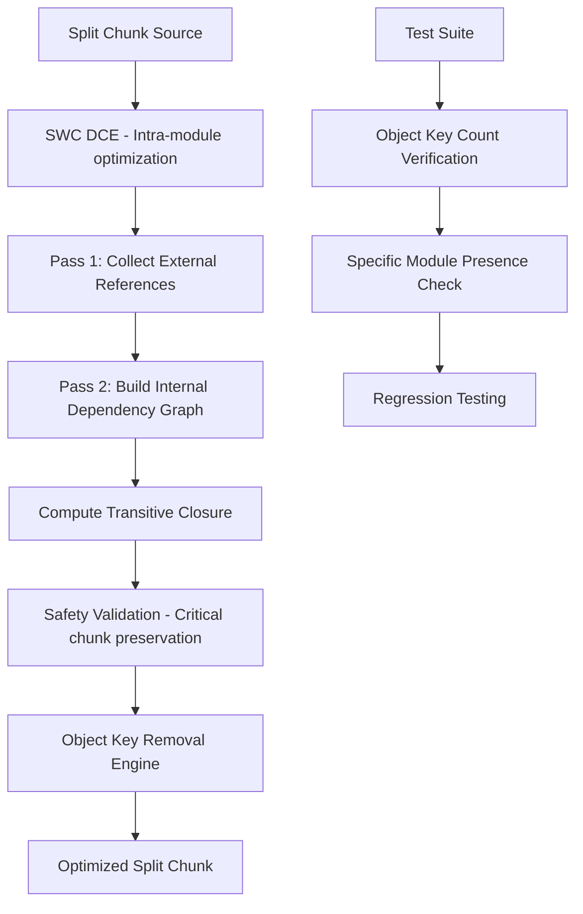

# Product Requirements Document: WASM Split Chunk Object Key Removal Enhancement

## 1. Product Overview

The SWC Macro WASM tree shaking optimizer currently achieves 35-40% size reduction in webpack split chunks through code stripping but leaves all object keys intact, resulting in vendor chunks with hundreds of empty module entries that are never referenced. This enhancement will implement complete unreferenced object key removal from split chunks to achieve true tree shaking capabilities, potentially increasing optimization effectiveness from 40% to 70%+ size reduction.

The target is to enable webpack split chunk optimization in WASM environments where unreferenced module keys can be safely removed from vendor/shared chunks without breaking application functionality, particularly for module federation scenarios with large dependency libraries like Lodash, Ramda, and Date-fns.

## 2. Core Features

### 2.1 Scope Definition

#### Chunks We Process (Split Chunks)
- **Vendor chunks**: `vendors-node_modules_lodash_*.js`
- **Shared chunks**: `shared-common-utils.js`
- **Library chunks**: Split out npm packages
- **Common chunks**: Shared code between multiple entry points

#### Chunks We Ignore
- **Runtime chunks**: Webpack runtime/bootstrap code
- **Entry chunks**: Application entry points
- **Bootstrap chunks**: Initial loading code
- **Main chunks**: Direct application code

#### Configuration-Driven Chunk Identification
Split chunks are identified through the `share-usage.json` configuration file:
- **Configuration Schema**: Library names as keys with export usage flags and chunk characteristics
- **Runtime Detection**: Use `chunk_characteristics.is_runtime_chunk` flag instead of name patterns
- **Chunk Mapping**: Match chunks via `chunk_characteristics.chunk_files` array
- **Export Usage**: Boolean flags indicate which exports are used (true) or unused (false)

### 2.2 Feature Module

Our WASM split chunk optimization enhancement consists of the following main components:
1. **Configuration-Driven Split Chunk Processing**: Use share-usage.json to identify chunks and determine export usage patterns
2. **Split Chunk Object Key Removal Engine**: Complete unreferenced module key elimination from vendor/shared chunks with safety checks
3. **Two-Pass Analysis System**: External reference collection and internal dependency graph building
4. **Enhanced Test Suite**: Comprehensive split chunk optimization verification and regression testing
5. **Integration Layer**: Improved coordination between SWC DCE and webpack analyzer components for split chunk processing
6. **Safety Validation**: Configuration-based chunk identification and preservation of critical chunks

### 2.3 Page Details

| Component | Module Name | Feature Description |
|-----------|-------------|--------------------||
| Split Chunk Object Key Removal Engine | Unreferenced Key Elimination | Remove unreferenced object keys from webpack split chunks while preserving externally referenced modules and their dependencies |
| Two-Pass Analysis System | External Reference & Dependency Analysis | Collect external references from other chunks and build internal dependency graphs within split chunks |
| Enhanced Test Suite | Split Chunk Optimization Verification | Verify actual object key removal with before/after key counting, specific module presence/absence validation |
| Integration Layer | SWC-Webpack Split Chunk Coordination | Improve integration between swc_macro_wasm optimize.rs and webpack_analyzer_v2 TreeShaker for split chunk processing |
| Safety Validation | Critical Chunk Preservation | Force preserve runtime chunks, entry chunks, bootstrap chunks while processing only vendor/shared split chunks |

## 3. Core Process

### 3.1 Current Process (Problematic)
1. SWC DCE performs intra-module dead code elimination within split chunks
2. Webpack analyzer identifies unreachable modules but doesn't remove object keys
3. AST pruner only removes unused exports within modules
4. Result: 35-40% size reduction with same object key count (e.g., lodash chunk: 640 keys → 640 keys)

### 3.2 Enhanced Process (Target)
1. **Configuration Loading**: Parse share-usage.json to identify chunk characteristics and export usage patterns
2. SWC DCE performs intra-module dead code elimination within split chunks
3. **Configuration-Driven Analysis**: Use export usage flags to guide external reference collection
4. Two-pass analysis: collect external references and build internal dependency graph
5. Compute transitive closure of reachable modules from external references
6. Split chunk object key removal engine eliminates unreferenced keys from AST
7. **Configuration-Based Safety**: Use is_runtime_chunk flag to preserve critical chunks
8. Result: 70%+ size reduction with actual object key count reduction

### 3.3 Two-Pass Analysis Algorithm

**Pass 1: Collect External References**
```javascript
// Analyze all OTHER chunks to see what they require from this split chunk
function collectExternalReferences(splitChunkId, allChunks) {
  const externalRefs = new Set();
  
  for (const chunk of allChunks) {
    if (chunk.id === splitChunkId) continue;
    
    // Find all __webpack_require__() calls in this chunk
    const requires = extractAllWebpackRequires(chunk);
    
    // Keep only requires that reference our split chunk's modules
    for (const req of requires) {
      if (splitChunkModules.has(req)) {
        externalRefs.add(req);
      }
    }
  }
  
  return externalRefs;
}
```

**Pass 2: Build Internal Dependency Graph**
```javascript
// Within the split chunk, map module dependencies
function buildInternalRequireGraph(splitChunk) {
  const graph = {};
  
  for (const [moduleKey, moduleFunc] of Object.entries(splitChunk.modules)) {
    // Extract requires from this module's function body
    const requires = extractWebpackRequires(moduleFunc);
    
    // Filter to only internal requires (within same chunk)
    const internalRequires = requires.filter(req =>
      splitChunk.modules.hasOwnProperty(req)
    );
    
    graph[moduleKey] = internalRequires;
  }
  
  return graph;
}
```



## 4. User Interface Design

### 4.1 Design Style
- **Primary Colors**: Terminal green (#00FF00) for success, red (#FF0000) for failures
- **Output Format**: Structured logging with clear before/after metrics
- **Font**: Monospace console output for technical details
- **Layout Style**: Command-line interface with detailed progress reporting
- **Icons**: ✅ for successful operations, ❌ for failures, 🔍 for analysis steps

### 4.2 Page Design Overview

| Component | Module Name | UI Elements |
|-----------|-------------|-------------|
| Test Output | Split Chunk Optimization Verification | Console logging with object key count comparisons, percentage reductions, specific module lists |
| Progress Reporting | Two-Pass Analysis Pipeline | Step-by-step progress with timing metrics, external reference counts, dependency graph size |
| Error Handling | Safety Validation Alerts | Clear warnings for preserved chunks, skip reasons, safety net activations |

### 4.3 Responsiveness
Command-line interface optimized for development environments, with detailed logging suitable for CI/CD pipeline integration and debugging workflows.

## 5. Problem Statement & Technical Analysis

### 5.1 Current Issue - Split Chunk Structure
The WASM tree shaking optimizer in `swc_macro_wasm` achieves significant size reduction (35-40%) in split chunks but fails to remove unreferenced object keys:

- **Lodash**: 640 object keys before → 640 object keys after (0 keys removed, 35.79% size reduction)
- **Ramda**: 367 object keys before → 367 object keys after (0 keys removed, 41.17% size reduction)  
- **Date-fns**: 304 object keys before → 304 object keys after (0 keys removed, 39.80% size reduction)

### 5.2 Configuration Schema (share-usage.json)

The optimization system is driven by a configuration file that defines:

```json
{
  "treeShake": {
    "lodash-es": {
      "map": true,
      "filter": true,
      "VERSION": true,
      "default": true,
      "add": false,
      "after": false,
      "chunk_characteristics": {
        "entry_module_id": "../../../node_modules/.pnpm/lodash-es@4.17.21/node_modules/lodash-es/lodash.js",
        "is_runtime_chunk": false,
        "has_runtime": false,
        "is_entrypoint": false,
        "chunk_files": [
          "vendors-node_modules_pnpm_lodash-es_4_17_21_node_modules_lodash-es_lodash_js.js"
        ],
        "is_shared_chunk": false
      }
    }
  }
}
```

**Configuration Elements:**
- **Export Usage Flags**: Boolean values indicating which exports are used (true) or unused (false)
- **chunk_characteristics**: Metadata about the chunk including runtime detection and file mapping
- **is_runtime_chunk**: Critical flag to skip runtime/bootstrap chunks
- **chunk_files**: Array mapping library to actual chunk file names

### 5.3 Example Split Chunk Structure

```javascript
// vendors-node_modules_pnpm_lodash-es_4_17_21_node_modules_lodash-es_lodash_js.js
exports.ids = ["vendors-node_modules_pnpm_lodash-es_4_17_21_node_modules_lodash-es_lodash_js"];
exports.modules = {
  "../../node_modules/.pnpm/lodash-es@4.17.21/node_modules/lodash-es/_DataView.js":
    function(__unused_webpack___webpack_module__, __webpack_exports__, __webpack_require__) {
      // Module implementation
    },
  "../../node_modules/.pnpm/lodash-es@4.17.21/node_modules/lodash-es/_arrayMap.js":
    function(__unused_webpack___webpack_module__, __webpack_exports__, __webpack_require__) {
      var DataView = __webpack_require__("../../node_modules/.pnpm/lodash-es@4.17.21/node_modules/lodash-es/_DataView.js");
      // Uses DataView
    },
  // ... 638 more modules, many unreferenced
};
```

### 5.4 Root Cause Analysis

1. **Configuration Gap**: Current approach lacks configuration-driven optimization decisions

2. **Heuristic Limitations**: Name pattern matching for chunk identification is unreliable

3. **Export Usage Blindness**: No knowledge of which exports are actually used by the application

4. **External Reference Analysis Missing**: No analysis of what other chunks require from split chunks

5. **AST Pruner Limitation**: The `AstModulePruner` in `tree_shaker.rs` only removes properties from module objects but doesn't eliminate entire object key entries

6. **Safety Override**: Excessive safety preservation may be preventing legitimate object key removal from split chunks

## 6. Detailed Requirements

### 6.1 Functional Requirements

**FR-1: Split Chunk Object Key Elimination**
- Remove unreferenced object keys from webpack split chunks, not just unused exports within modules
- Achieve object key count reduction proportional to size reduction
- Target: If 40% size reduction is achieved, expect 30-50% object key count reduction

**FR-2: Two-Pass Analysis System**
- Pass 1: Collect external references from all other chunks that reference this split chunk
- Pass 2: Build internal dependency graph within the split chunk
- Compute transitive closure of reachable modules from external references

**FR-3: Enhanced Safety Validation**
- Process only split chunks (vendor/shared chunks)
- Skip runtime chunks, entry chunks, bootstrap chunks
- Preserve externally referenced modules and their transitive dependencies

**FR-4: Configuration-Driven Split Chunk Identification**
- Parse share-usage.json configuration file to identify chunks
- Use chunk_characteristics.is_runtime_chunk flag for runtime detection
- Match chunks via chunk_characteristics.chunk_files array
- Leverage export usage flags to determine optimization scope

**FR-5: Comprehensive Testing**
- Verify actual object key count reduction in test suite
- Test specific module presence/absence in split chunks
- Regression testing for existing functionality

### 6.2 Non-Functional Requirements

**NFR-1: Performance**
- Split chunk optimization should complete within 5 seconds for typical vendor chunks
- Memory usage should not exceed 2x original chunk size during processing

**NFR-2: Reliability**
- Never remove object keys that are actually required by other chunks
- Graceful degradation when optimization cannot be safely applied
- Comprehensive error handling and logging

**NFR-3: Maintainability**
- Clear separation between external reference analysis and internal dependency analysis
- Detailed logging for debugging optimization decisions
- Modular architecture supporting different webpack split chunk formats

## 7. Test Strategy

### 7.1 Configuration-Driven Split Chunk Optimization Tests

**Test Case 1: Configuration-Based Chunk Processing**
```rust
#[test]
fn test_configuration_driven_chunk_processing() {
    let config = load_share_usage_config("test-cases/rspack-annotated-output/share-usage.json");
    let chunk = load_chunk("vendors-node_modules_pnpm_lodash-es_4_17_21_node_modules_lodash-es_lodash_js.js");
    
    // Verify chunk is identified correctly from configuration
    assert!(optimizer.should_process_chunk(&chunk, &config));
    
    // Verify export usage flags are applied
    let used_exports = config.get_used_exports("lodash-es");
    assert!(used_exports.contains("map"));
    assert!(used_exports.contains("filter"));
    assert!(!used_exports.contains("add"));
}
```

**Test Case 2: Runtime Chunk Preservation via Configuration**
```rust
#[test]
fn test_runtime_chunk_preservation() {
    let config = load_share_usage_config("test-cases/share-usage.json");
    
    // Verify runtime chunks are skipped based on is_runtime_chunk flag
    for (lib_name, lib_config) in &config.tree_shake {
        if lib_config.chunk_characteristics.is_runtime_chunk {
            assert!(!optimizer.should_process_chunk(&chunk, &config));
        }
    }
}
```

**Test Case 3: Export Usage Flag Integration**
```rust
#[test]
fn test_export_usage_flag_integration() {
    let config = load_share_usage_config("test-cases/share-usage.json");
    let chunk = load_lodash_chunk();
    
    // Apply optimization with configuration
    let optimized = optimizer.optimize_with_config(&chunk, &config);
    
    // Verify only unused exports (false flags) are removed
    assert!(!optimized.contains_key("add")); // marked as false
    assert!(optimized.contains_key("map")); // marked as true
}
```

**Test Case 4: Configuration Schema Validation**
```rust
#[test]
fn test_configuration_schema_validation() {
    // Test valid configuration parsing
    let valid_config = load_share_usage_config("test-cases/valid-share-usage.json");
    assert!(valid_config.is_ok());
    
    // Test invalid configuration handling
    let invalid_config = load_share_usage_config("test-cases/invalid-share-usage.json");
    assert!(invalid_config.is_err());
}
```

### 7.2 Regression Testing
- All existing tests must continue to pass
- Size reduction should be maintained or improved
- No functional regressions in optimized code

## 8. Implementation Approach

### 8.1 Phase 1: Split Chunk Identification and Two-Pass Analysis

**File**: `crates/webpack_analyzer_v2/src/tree_shaker.rs`

**Changes**:
```rust
impl SplitChunkOptimizer {
    /// Process chunks based on share-usage.json configuration
    fn should_process_chunk(&self, chunk: &Chunk, config: &ShareUsageConfig) -> bool {
        // Find matching library configuration
        for (lib_name, lib_config) in &config.tree_shake {
            if lib_config.chunk_characteristics.chunk_files.contains(&chunk.name) {
                // Skip runtime chunks as specified in configuration
                return !lib_config.chunk_characteristics.is_runtime_chunk;
            }
        }
        false // Skip chunks not found in configuration
    }
    
    /// Find which modules in split chunk are referenced by other chunks
    fn find_external_references(
        &self,
        split_chunk_modules: &HashSet<String>,
        other_chunks: &[Chunk]
    ) -> HashSet<String> {
        let mut external_refs = HashSet::new();
        
        for chunk in other_chunks {
            // Extract all webpack_require calls from chunk
            let requires = self.extract_all_requires(chunk);
            
            // Keep requires that reference our split chunk's modules
            for req in requires {
                if split_chunk_modules.contains(&req) {
                    external_refs.insert(req);
                }
            }
        }
        
        external_refs
    }
    
    /// Find all modules transitively required from external references
    fn compute_transitive_closure(
        &self,
        external_refs: &HashSet<String>,
        internal_graph: &HashMap<String, Vec<String>>
    ) -> HashSet<String> {
        let mut reachable = external_refs.clone();
        let mut queue: VecDeque<_> = external_refs.iter().cloned().collect();
        
        while let Some(current) = queue.pop_front() {
            if let Some(deps) = internal_graph.get(&current) {
                for dep in deps {
                    if !reachable.contains(dep) {
                        reachable.insert(dep.clone());
                        queue.push_back(dep.clone());
                    }
                }
            }
        }
        
        reachable
    }
}
```

### 8.2 Phase 2: Enhanced AST Object Key Pruner

**File**: `crates/webpack_analyzer_v2/src/tree_shaker.rs`

**Changes**:
- Modify `AstModulePruner` to remove entire object key entries, not just properties
- Handle different webpack split chunk formats (CommonJS, ESM, JSONP)
- Add comprehensive object key removal logic for `exports.modules` objects

### 8.3 Phase 3: Configuration Integration Layer

**File**: `crates/swc_macro_wasm/src/optimize.rs`

**Changes**:
```rust
// Add configuration parsing and integration
pub fn optimize_with_share_usage_config(
    source: &str,
    config_path: &str,
) -> Result<String, OptimizationError> {
    let config = ShareUsageConfig::load_from_file(config_path)?;
    
    // Parse and identify chunks using configuration
    let chunks = parse_webpack_chunks(source)?;
    let mut optimized_chunks = Vec::new();
    
    for chunk in chunks {
        if should_process_chunk_with_config(&chunk, &config) {
            let optimized = optimize_split_chunk_with_config(&chunk, &config)?;
            optimized_chunks.push(optimized);
        } else {
            optimized_chunks.push(chunk); // Preserve unprocessed chunks
        }
    }
    
    Ok(serialize_chunks(optimized_chunks))
}
```

- Enhance `run_webpack_tree_shake` to accept configuration parameter
- Add configuration-driven chunk identification logic
- Implement export usage flag integration
- Add detailed metrics tracking and logging

### 8.4 Phase 4: Configuration-Driven Test Suite

**Files**: `crates/swc_macro_wasm/tests/*`

**Changes**:
- Add configuration-driven split chunk optimization tests
- Create test fixtures with share-usage.json configuration files
- Implement configuration schema validation tests
- Add export usage flag verification tests
- Create performance tests with configuration-based optimization
- Add regression tests ensuring configuration compatibility

## 9. Success Criteria

### 9.1 Primary Success Metrics

**Split Chunk Object Key Removal Effectiveness**
- Achieve actual object key count reduction (target: 30-50% for test cases)
- Maintain or improve size reduction (target: 50-70% vs current 35-40%)
- Zero false positives (no externally referenced modules removed)

**Test Coverage**
- 100% of new split chunk optimization tests pass
- All existing regression tests continue to pass
- Performance tests meet specified benchmarks

### 9.2 Quality Gates

**Before Release**
- All critical chunk preservation tests pass
- No performance regressions in optimization time
- Comprehensive logging and error handling implemented
- Documentation updated with new split chunk capabilities

**Post-Release Validation**
- Real-world webpack split chunks show improved optimization
- No reported issues with over-aggressive object key removal
- Performance metrics meet or exceed targets

## 10. Risk Assessment & Mitigation

### 10.1 High-Risk Areas

**Risk**: Over-aggressive object key removal breaking runtime functionality
**Mitigation**: Comprehensive external reference analysis, conservative defaults, extensive testing

**Risk**: Performance degradation due to two-pass analysis complexity
**Mitigation**: Optimization timeouts, incremental analysis, performance monitoring

**Risk**: Compatibility issues with different webpack split chunk versions/formats
**Mitigation**: Format detection, graceful fallbacks, comprehensive test coverage


## 11. Timeline & Milestones

**Week 1-2**: Split chunk identification and two-pass analysis implementation
**Week 3**: Enhanced AST object key pruner for split chunks
**Week 4**: Improved integration layer and split chunk processing coordination
**Week 5-6**: Comprehensive test suite development and validation
**Week 7**: Performance optimization and documentation
**Week 8**: Final testing, code review, and release preparation

This PRD provides a comprehensive roadmap for implementing true object key-level tree shaking in webpack split chunks within the WASM optimizer, addressing the current limitation where only intra-module optimization occurs while unreferenced object keys remain in vendor/shared chunks.