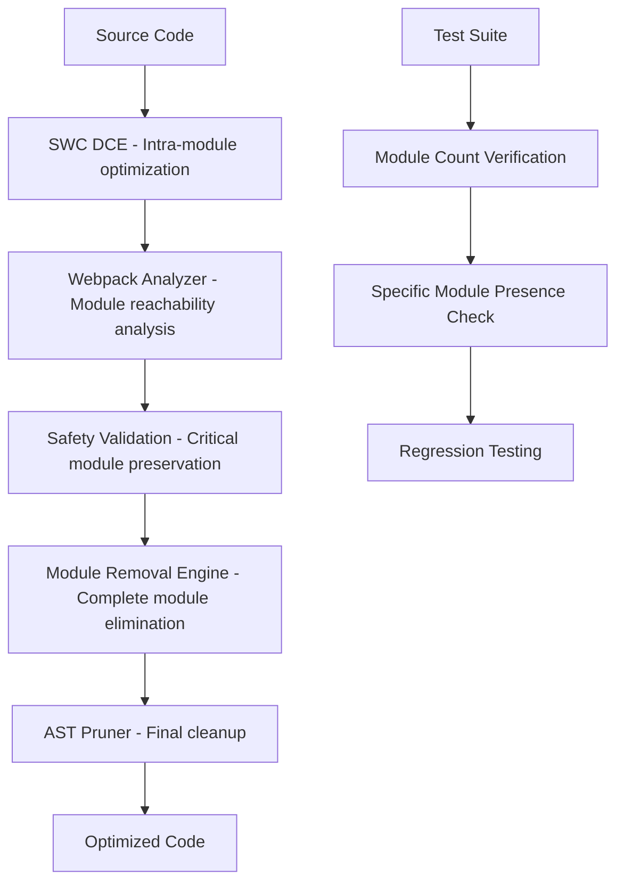

# Product Requirements Document: WASM Tree Shaking Module Removal Enhancement

## 1. Product Overview

The SWC Macro WASM tree shaking optimizer currently achieves 35-40% size reduction by removing unused code within modules but fails to remove entire unused modules themselves. This enhancement will implement complete unused module elimination to achieve true tree shaking capabilities, potentially increasing optimization effectiveness from 40% to 70%+ size reduction.

The target is to enable webpack bundle optimization in WASM environments where complete unused modules can be safely removed without breaking application functionality, particularly for module federation scenarios with large dependency libraries like Lodash, Ramda, and Date-fns.

## 2. Core Features

### 2.1 Feature Module

Our WASM tree shaking enhancement consists of the following main components:
1. **Module Removal Engine**: Complete unused module elimination with safety checks
2. **Enhanced Test Suite**: Comprehensive module removal verification and regression testing
3. **Integration Layer**: Improved coordination between SWC DCE and webpack analyzer components
4. **Safety Validation**: Runtime dependency analysis and preservation of critical modules

### 2.2 Page Details

| Component | Module Name | Feature Description |
|-----------|-------------|--------------------|
| Module Removal Engine | Complete Module Elimination | Remove entire unused modules from webpack chunks while preserving module dependencies and runtime requirements |
| Enhanced Test Suite | Module Count Verification | Verify actual module removal with before/after module counting, specific module presence/absence validation |
| Integration Layer | SWC-Webpack Coordination | Improve integration between swc_macro_wasm optimize.rs and webpack_analyzer_v2 TreeShaker for complete module removal |
| Safety Validation | Critical Module Preservation | Force preserve scheduler modules, runtime chunks, and modules with complex dependency patterns |

## 3. Core Process

### 3.1 Current Process (Problematic)
1. SWC DCE performs intra-module dead code elimination
2. Webpack analyzer identifies unreachable modules but doesn't remove them
3. AST pruner only removes unused exports within modules
4. Result: 35-40% size reduction with same module count

### 3.2 Enhanced Process (Target)
1. SWC DCE performs intra-module dead code elimination
2. Webpack analyzer identifies unreachable modules with enhanced safety checks
3. Module removal engine eliminates entire unused modules from AST
4. Safety validation preserves critical modules (scheduler, runtime dependencies)
5. Iterative optimization continues until convergence
6. Result: 70%+ size reduction with actual module count reduction



## 4. User Interface Design

### 4.1 Design Style
- **Primary Colors**: Terminal green (#00FF00) for success, red (#FF0000) for failures
- **Output Format**: Structured logging with clear before/after metrics
- **Font**: Monospace console output for technical details
- **Layout Style**: Command-line interface with detailed progress reporting
- **Icons**: ✅ for successful operations, ❌ for failures, 🔍 for analysis steps

### 4.2 Page Design Overview

| Component | Module Name | UI Elements |
|-----------|-------------|-------------|
| Test Output | Module Removal Verification | Console logging with module count comparisons, percentage reductions, specific module lists |
| Progress Reporting | Optimization Pipeline | Step-by-step progress with timing metrics, iteration counts, convergence indicators |
| Error Handling | Safety Validation Alerts | Clear warnings for preserved modules, skip reasons, safety net activations |

### 4.3 Responsiveness
Command-line interface optimized for development environments, with detailed logging suitable for CI/CD pipeline integration and debugging workflows.

## 5. Problem Statement & Technical Analysis

### 5.1 Current Issue
The WASM tree shaking optimizer in `swc_macro_wasm` achieves significant size reduction (35-40%) but fails to remove entire unused modules:

- **Lodash**: 640 modules before → 640 modules after (0 modules removed, 35.79% size reduction)
- **Ramda**: 367 modules before → 367 modules after (0 modules removed, 41.17% size reduction)  
- **Date-fns**: 304 modules before → 304 modules after (0 modules removed, 39.80% size reduction)

### 5.2 Root Cause Analysis

1. **Integration Gap**: The `run_webpack_tree_shake` function in `optimize.rs` calls `analyzer_shaker.prune_source()` but the returned optimized source doesn't reflect complete module removal

2. **AST Pruner Limitation**: The `AstModulePruner` in `tree_shaker.rs` only removes properties from module objects but doesn't eliminate entire module entries

3. **Safety Override**: Excessive safety preservation (scheduler modules, runtime chunks) may be preventing legitimate module removal

4. **Convergence Issue**: The iterative optimization loop may not be properly detecting when modules become unreachable after intra-module DCE

## 6. Detailed Requirements

### 6.1 Functional Requirements

**FR-1: Complete Module Elimination**
- Remove entire unused modules from webpack chunks, not just unused exports within modules
- Achieve module count reduction proportional to size reduction
- Target: If 40% size reduction is achieved, expect 30-50% module count reduction

**FR-2: Enhanced Safety Validation**
- Preserve scheduler modules and runtime dependencies
- Maintain entry point modules and their direct dependencies
- Skip optimization for runtime chunks and entry points

**FR-3: Iterative Optimization**
- Continue optimization until convergence (no more modules can be removed)
- Maximum 5 iterations to prevent infinite loops
- Track metrics across iterations

**FR-4: Comprehensive Testing**
- Verify actual module count reduction in test suite
- Test specific module presence/absence
- Regression testing for existing functionality

### 6.2 Non-Functional Requirements

**NFR-1: Performance**
- Optimization should complete within 5 seconds for typical chunks
- Memory usage should not exceed 2x original chunk size during processing

**NFR-2: Reliability**
- Never remove modules that are actually required at runtime
- Graceful degradation when optimization cannot be safely applied
- Comprehensive error handling and logging

**NFR-3: Maintainability**
- Clear separation between analysis and transformation phases
- Detailed logging for debugging optimization decisions
- Modular architecture supporting different webpack formats

## 7. Test Strategy

### 7.1 Module Removal Verification Tests

**Test Case 1: Unused Module Detection**
```rust
#[test]
fn test_complete_unused_module_removal() {
    // Create chunk with known unused modules
    // Apply optimization
    // Verify module count reduction
    // Verify specific unused modules are absent
    assert!(modules_after < modules_before);
    assert!(!optimized_chunk.contains_module("unused_module_id"));
}
```

**Test Case 2: Critical Module Preservation**
```rust
#[test]
fn test_critical_module_preservation() {
    // Verify scheduler modules are never removed
    // Verify entry point modules are preserved
    // Verify runtime dependencies are maintained
}
```

**Test Case 3: Iterative Convergence**
```rust
#[test]
fn test_optimization_convergence() {
    // Verify optimization reaches stable state
    // Verify no infinite loops
    // Verify metrics tracking across iterations
}
```

### 7.2 Regression Testing
- All existing tests must continue to pass
- Size reduction should be maintained or improved
- No functional regressions in optimized code

## 8. Implementation Approach

### 8.1 Phase 1: Enhanced AST Module Pruner

**File**: `crates/webpack_analyzer_v2/src/tree_shaker.rs`

**Changes**:
- Modify `AstModulePruner` to remove entire module entries, not just properties
- Handle different webpack module formats (CommonJS, ESM, JSONP)
- Add comprehensive module removal logic for `__webpack_modules__` objects

### 8.2 Phase 2: Improved Integration Layer

**File**: `crates/swc_macro_wasm/src/optimize.rs`

**Changes**:
- Enhance `run_webpack_tree_shake` to properly handle complete module removal
- Improve iterative optimization loop with better convergence detection
- Add detailed metrics tracking and logging

### 8.3 Phase 3: Enhanced Safety Validation

**File**: `crates/webpack_analyzer_v2/src/tree_shaker.rs`

**Changes**:
- Refine critical module preservation logic
- Improve entry point detection and dependency analysis
- Add configurable safety levels for different optimization scenarios

### 8.4 Phase 4: Comprehensive Test Suite

**Files**: `crates/swc_macro_wasm/tests/*`

**Changes**:
- Add module removal verification tests
- Implement module counting and comparison utilities
- Create test fixtures with known unused modules
- Add performance and reliability tests

## 9. Success Criteria

### 9.1 Primary Success Metrics

**Module Removal Effectiveness**
- Achieve actual module count reduction (target: 30-50% for test cases)
- Maintain or improve size reduction (target: 50-70% vs current 35-40%)
- Zero false positives (no required modules removed)

**Test Coverage**
- 100% of new module removal tests pass
- All existing regression tests continue to pass
- Performance tests meet specified benchmarks

### 9.2 Quality Gates

**Before Release**
- All critical module preservation tests pass
- No performance regressions in optimization time
- Comprehensive logging and error handling implemented
- Documentation updated with new capabilities

**Post-Release Validation**
- Real-world webpack bundles show improved optimization
- No reported issues with over-aggressive module removal
- Performance metrics meet or exceed targets

## 10. Risk Assessment & Mitigation

### 10.1 High-Risk Areas

**Risk**: Over-aggressive module removal breaking runtime functionality
**Mitigation**: Comprehensive safety validation, conservative defaults, extensive testing

**Risk**: Performance degradation due to complex analysis
**Mitigation**: Optimization timeouts, incremental analysis, performance monitoring

**Risk**: Compatibility issues with different webpack versions/formats
**Mitigation**: Format detection, graceful fallbacks, comprehensive test coverage

### 10.2 Rollback Strategy

- Feature flags to disable complete module removal
- Fallback to current intra-module optimization only
- Detailed logging to identify problematic cases
- Gradual rollout with monitoring

## 11. Timeline & Milestones

**Week 1-2**: Enhanced AST Module Pruner implementation
**Week 3**: Improved integration layer and iterative optimization
**Week 4**: Enhanced safety validation and critical module preservation
**Week 5-6**: Comprehensive test suite development and validation
**Week 7**: Performance optimization and documentation
**Week 8**: Final testing, code review, and release preparation

This PRD provides a comprehensive roadmap for implementing true module-level tree shaking in the WASM optimizer, addressing the current limitation where only intra-module optimization occurs while complete unused modules remain in the output.