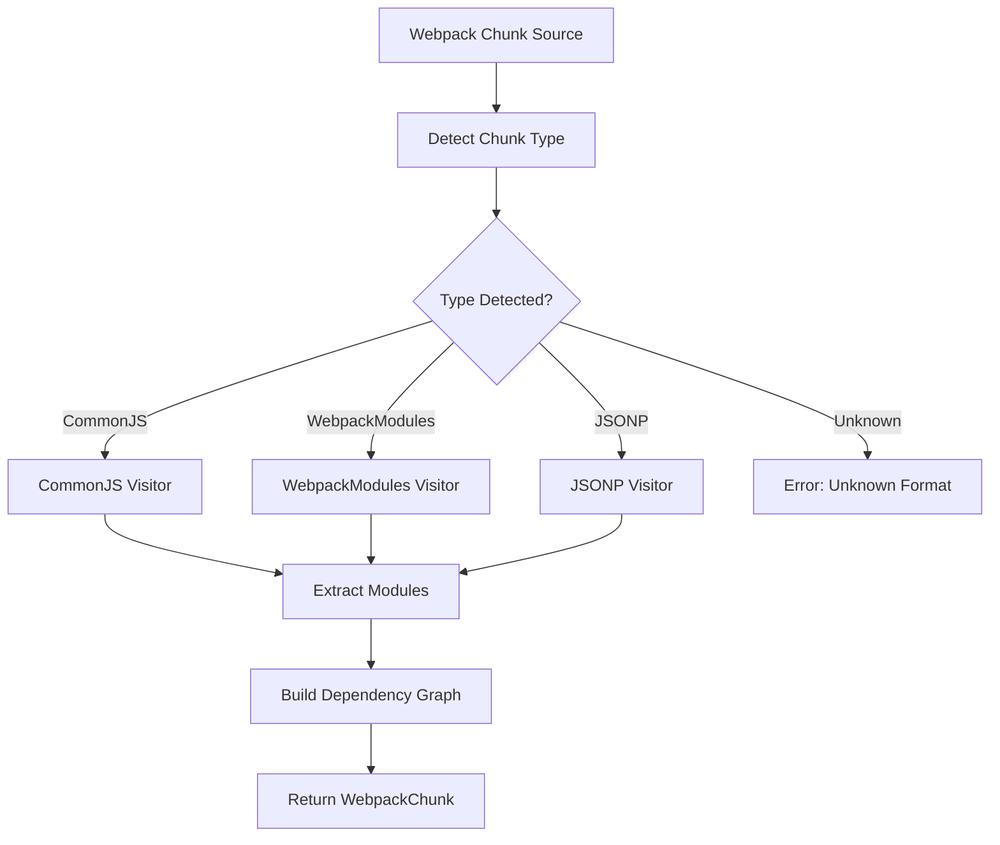

# Webpack Chunk Classification and Analysis

## Overview

The webpack analyzer automatically detects and classifies different types of webpack chunk formats to properly extract modules and build dependency graphs.

## Chunk Type Detection

The analyzer uses pattern matching in the source code to identify chunk types in the following priority order:

### 1. CommonJS Format
**Pattern:** `exports.modules`
```javascript
"use strict";
exports.modules = {
    "module1.js": function(__webpack_module__, __webpack_exports__, __webpack_require__) {
        // module code
    }
};
```

### 2. WebpackModules Format  
**Pattern:** `__webpack_modules__`
```javascript
var __webpack_modules__ = {
    "module1.js": function(__webpack_module__, __webpack_exports__, __webpack_require__) {
        // module code
    }
};
```

### 3. JSONP Format
**Pattern:** `webpackChunk` AND `].push([`
```javascript
(self["webpackChunkapp"] = self["webpackChunkapp"] || []).push([
    ["chunk-id"], 
    {
        "module1.js": function(__webpack_module__, __webpack_exports__, __webpack_require__) {
            // module code
        }
    }
]);
```

## Implementation Details

### Detection Function
```rust
pub fn detect_chunk_type(&self, source: &str) -> Result<ChunkType> {
    if source.contains("exports.modules") {
        Ok(ChunkType::CommonJS)
    } else if source.contains("__webpack_modules__") {
        Ok(ChunkType::WebpackModules)
    } else if source.contains("webpackChunk") && source.contains("].push([") {
        Ok(ChunkType::JSONP)
    } else {
        Err("Unknown chunk type - not a recognized webpack chunk format".into())
    }
}
```

### Safety Improvements
- **Specific Pattern Matching:** Uses `].push([` instead of dangerous `.push(` to avoid false positives
- **Order Priority:** WebpackModules checked before JSONP to prevent misclassification
- **Single Parse:** Source is parsed once then reused for module extraction and dependency analysis

## Module Extraction Process

1. **Parse Source Code:** Convert JavaScript to AST using SWC parser
2. **Extract Modules:** Use format-specific visitors to extract module definitions
3. **Build Dependencies:** Analyze `__webpack_require__` calls within module sources
4. **Create Graph:** Build bidirectional dependency relationships

## Performance Optimizations

- **Single Parse Pass:** Parse source code only once per chunk analysis
- **Atom Types:** Use SWC's `Atom` type instead of `String` for module IDs
- **Efficient Visitors:** AST visitors tailored for each chunk format

## Error Handling

- **Malformed Chunks:** Gracefully handle invalid JavaScript syntax
- **Missing Patterns:** Return descriptive errors for unrecognized formats
- **Empty Sources:** Handle edge cases with empty or minimal content

## Analysis Flow



## File Locations

- **Main Analyzer:** `crates/webpack_analyzer_v2/src/analyzer.rs`
- **Chunk Types:** `crates/webpack_analyzer_v2/src/chunk.rs`
- **Module Definitions:** `crates/webpack_analyzer_v2/src/module.rs`
- **Dependency Graph:** `crates/webpack_analyzer_v2/src/dependency_graph.rs`

This classification system enables the analyzer to correctly process webpack bundles from various build tools and configurations while maintaining high performance and accuracy.