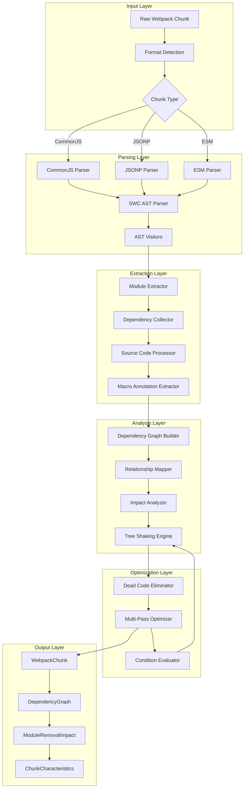
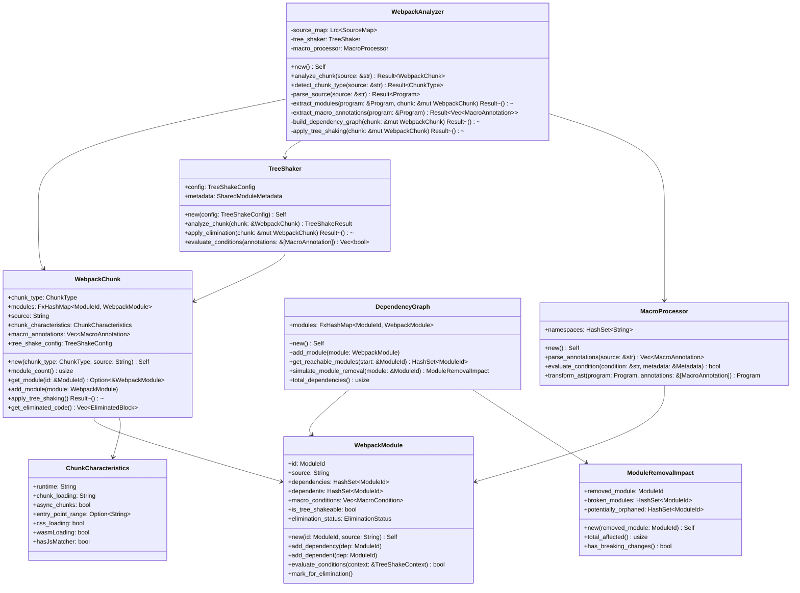
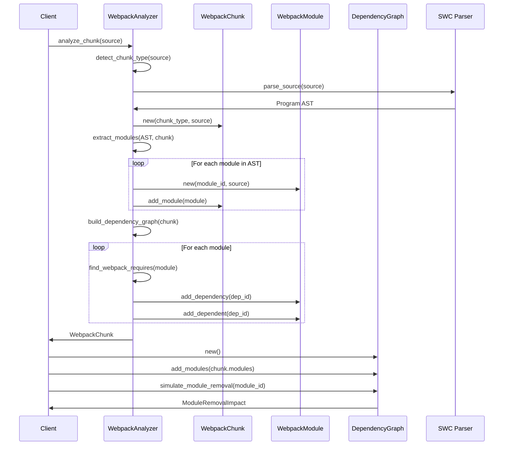
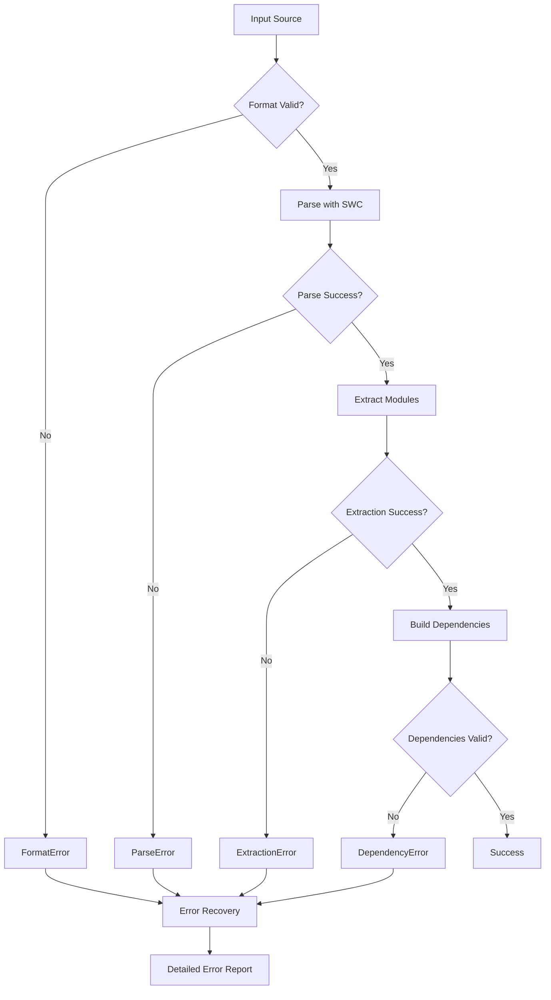
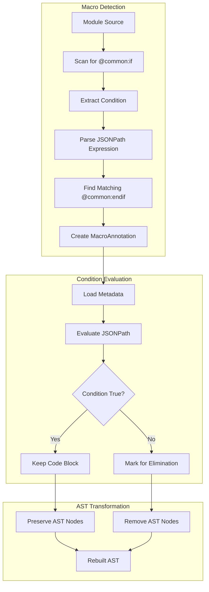
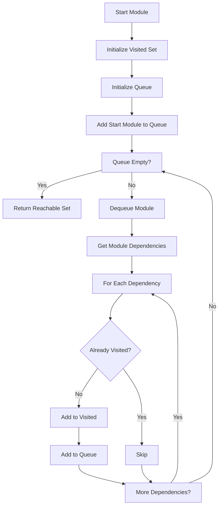
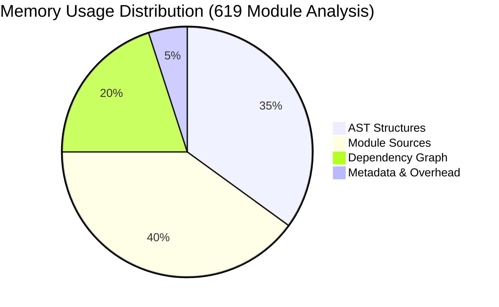
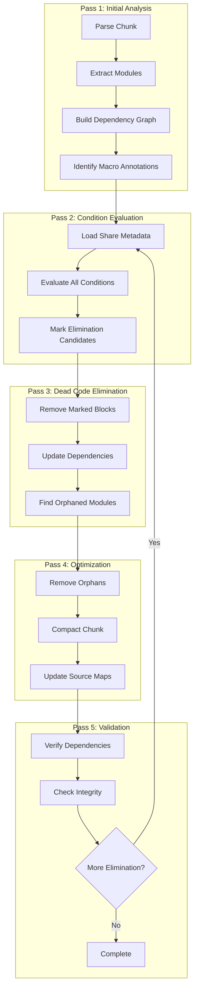

# Webpack Analyzer V2 - Technical Guide

## Table of Contents
1. [Overview](#overview)
2. [System Architecture](#system-architecture)
3. [Component Design](#component-design)
4. [Data Flow](#data-flow)
5. [Module Processing Pipeline](#module-processing-pipeline)
6. [Dependency Resolution](#dependency-resolution)
7. [Performance Considerations](#performance-considerations)
8. [Extension Points](#extension-points)

---

## Overview

The Webpack Analyzer V2 is designed as a modular, high-performance static analysis system for webpack bundles with integrated tree shaking and dead code elimination capabilities. The architecture emphasizes separation of concerns, maintainability, and extensibility while providing robust analysis and optimization capabilities for modern JavaScript applications.

### Design Principles

- **Accuracy First**: 100% reliable dependency detection using AST parsing
- **Performance**: Efficient handling of large bundles (600+ modules)
- **Modularity**: Clean separation between parsing, analysis, optimization, and output
- **Tree Shaking**: Advanced dead code elimination with macro annotation support
- **Extensibility**: Plugin-ready architecture for future webpack features
- **Type Safety**: Comprehensive Rust type system for error prevention
- **Multi-Pass Optimization**: Iterative refinement for maximum code elimination

### Core Capabilities

- **Chunk Analysis**: Support for JSONP, CommonJS, and ESM formats
- **Dependency Resolution**: Complete dependency graph construction
- **Tree Shaking**: Conditional compilation with `@common:if`/`@common:endif` macros
- **Dead Code Elimination**: Multi-pass optimization pipeline
- **Impact Analysis**: Module removal simulation and orphan detection
- **Chunk Characteristics**: Runtime metadata and loading configuration

## System Architecture



### Layer Responsibilities

1. **Input Layer**: Format detection and initial validation
2. **Parsing Layer**: AST construction and traversal for JSONP, CommonJS, and ESM
3. **Extraction Layer**: Module, dependency, and macro annotation extraction
4. **Analysis Layer**: Graph construction, impact analysis, and tree shaking
5. **Optimization Layer**: Multi-pass dead code elimination and condition evaluation
6. **Output Layer**: Structured data representation with chunk characteristics

### Integration with SWC Macro System

The analyzer integrates with three key crates for macro processing:

- **swc_macro_parser**: Regex-based macro parsing with namespace filtering
- **swc_macro_condition_transform**: Conditional compilation with JSONPath evaluation
- **swc_macro_wasm**: Multi-pass optimization pipeline with DCE integration

See [TREE_SHAKING_DESIGN.md](./TREE_SHAKING_DESIGN.md) for detailed implementation specifications.

## Component Design

### Core Components Architecture



### Component Interactions



## Data Flow

### Analysis Pipeline

```mermaid
flowchart TD
    subgraph "Input Processing"
        A[Raw Source] --> B[Format Detection]
        B --> C{Valid Format?}
        C -->|Yes| D[Chunk Type Identified]
        C -->|No| E[Error: Unknown Format]
    end
    
    subgraph "AST Processing"
        D --> F[SWC Parser]
        F --> G[Program AST]
        G --> H{Chunk Type}
        H -->|CommonJS| I[CommonJS Visitor]
        H -->|JSONP| J[JSONP Visitor]
    end
    
    subgraph "Module Extraction"
        I --> K[Extract exports.modules]
        J --> L[Extract .push() modules]
        K --> M[Module Object Processing]
        L --> M
        M --> N[Create WebpackModule]
    end
    
    subgraph "Dependency Analysis"
        N --> O[Scan for __webpack_require__]
        O --> P[Extract Module IDs]
        P --> Q[Build Dependency Map]
        Q --> R[Build Dependents Map]
    end
    
    subgraph "Graph Construction"
        R --> S[Create DependencyGraph]
        S --> T[Validate Relationships]
        T --> U[Complete Analysis]
    end
```

### Error Handling Flow



## Module Processing Pipeline

### Macro Annotation Processing



### CommonJS Processing

```mermaid
flowchart TD
    subgraph "CommonJS Module Processing"
        A[exports.modules = {...}] --> B[Locate Object Literal]
        B --> C[Extract Key-Value Pairs]
        C --> D[Process Each Module]
        
        D --> E[Extract Module ID]
        E --> F[Extract Function Source]
        F --> G[Parse Function Body]
        G --> H[Find __webpack_require__ calls]
        H --> I[Create WebpackModule]
        
        I --> J{More Modules?}
        J -->|Yes| D
        J -->|No| K[Complete Processing]
    end
```

### JSONP Processing

```mermaid
flowchart TD
    subgraph "JSONP Module Processing"
        A[.push([ids, modules])] --> B[Locate Call Expression]
        B --> C[Extract Array Arguments]
        C --> D[Get Second Argument (modules)]
        
        D --> E[Extract Module Object]
        E --> F[Process Each Module]
        F --> G[Extract Module ID]
        G --> H[Extract Function Source]
        H --> I[Parse Function Body]
        I --> J[Find __webpack_require__ calls]
        J --> K[Create WebpackModule]
        
        K --> L{More Modules?}
        L -->|Yes| F
        L -->|No| M[Complete Processing]
    end
```

### Dependency Extraction Algorithm

```rust
fn extract_dependencies(module_source: &str) -> Vec<ModuleId> {
    let mut dependencies = Vec::new();
    
    // Parse the module source with SWC
    let program = parse_module_source(module_source)?;
    
    // Visit all call expressions
    program.visit_with(&mut CallExpressionVisitor {
        on_call: |call_expr| {
            // Check if it's a __webpack_require__ call
            if is_webpack_require_call(call_expr) {
                if let Some(module_id) = extract_module_id(call_expr) {
                    dependencies.push(module_id);
                }
            }
        }
    });
    
    dependencies
}
```

## Dependency Resolution

### Graph Building Strategy

```mermaid
graph TD
    subgraph "Module A"
        A1[Module ID: ./src/a.js]
        A2[Dependencies: [./src/b.js, lodash]]
        A3[Dependents: [./src/entry.js]]
    end
    
    subgraph "Module B"
        B1[Module ID: ./src/b.js]
        B2[Dependencies: [lodash]]
        B3[Dependents: [./src/a.js]]
    end
    
    subgraph "Module Lodash"
        L1[Module ID: lodash]
        L2[Dependencies: []]
        L3[Dependents: [./src/a.js, ./src/b.js]]
    end
    
    A1 --> B1
    A1 --> L1
    B1 --> L1
    
    subgraph "Dependency Graph"
        DG[Graph Structure]
        DG --> Forward[Forward Dependencies]
        DG --> Reverse[Reverse Dependencies]
        Forward --> FMap[ModuleId → Set<ModuleId>]
        Reverse --> RMap[ModuleId → Set<ModuleId>]
    end
```

### Reachability Analysis



### Impact Analysis Algorithm

```rust
impl DependencyGraph {
    fn simulate_module_removal(&self, module_to_remove: &ModuleId) -> ModuleRemovalImpact {
        let mut impact = ModuleRemovalImpact::new(module_to_remove.clone());
        
        // Step 1: Find directly broken modules
        if let Some(module) = self.modules.get(module_to_remove) {
            impact.broken_modules.extend(module.dependents.clone());
        }
        
        // Step 2: Find potentially orphaned modules
        for dependent in &impact.broken_modules {
            if self.would_become_orphaned(dependent, module_to_remove) {
                impact.potentially_orphaned.insert(dependent.clone());
            }
        }
        
        // Step 3: Transitive impact analysis
        let mut queue = VecDeque::new();
        queue.extend(impact.broken_modules.iter().cloned());
        
        while let Some(current) = queue.pop_front() {
            if let Some(module) = self.modules.get(&current) {
                for dependent in &module.dependents {
                    if !impact.broken_modules.contains(dependent) {
                        if self.would_be_affected(dependent, &impact.broken_modules) {
                            impact.potentially_orphaned.insert(dependent.clone());
                            queue.push_back(dependent.clone());
                        }
                    }
                }
            }
        }
        
        impact
    }
}
```

## Performance Considerations

### Memory Management



### Performance Optimization Strategies

1. **Lazy Loading**
   ```rust
   struct LazyModule {
       id: ModuleId,
       source: Option<String>,  // Load on demand
       dependencies: OnceCell<HashSet<ModuleId>>,
   }
   ```

2. **Memory Pool Allocation**
   ```rust
   struct ModulePool {
       modules: Vec<WebpackModule>,
       free_list: Vec<usize>,
   }
   ```

3. **Parallel Processing**
   ```rust
   fn extract_modules_parallel(chunks: Vec<&str>) -> Vec<WebpackModule> {
       chunks.par_iter()
           .map(|chunk| extract_module(chunk))
           .collect()
   }
   ```

### Complexity Analysis

| Operation | Best Case | Average Case | Worst Case |
|-----------|-----------|--------------|------------|
| Format Detection | O(1) | O(n) | O(n) |
| AST Parsing | O(n) | O(n) | O(n²) |
| Module Extraction | O(n) | O(n) | O(n²) |
| Dependency Resolution | O(n) | O(n·m) | O(n²·m) |
| Graph Construction | O(n+e) | O(n+e) | O(n+e) |
| Impact Analysis | O(n) | O(n+e) | O(n²) |

Where:
- n = number of modules
- m = average dependencies per module
- e = total edges in dependency graph

## Extension Points

### Plugin Architecture

```rust
trait AnalysisPlugin {
    fn name(&self) -> &str;
    fn process_module(&self, module: &WebpackModule) -> Result<()>;
    fn post_analysis(&self, chunk: &WebpackChunk) -> Result<()>;
}

struct AnalysisContext {
    plugins: Vec<Box<dyn AnalysisPlugin>>,
}

impl AnalysisContext {
    fn run_plugins(&self, chunk: &WebpackChunk) -> Result<()> {
        for plugin in &self.plugins {
            plugin.post_analysis(chunk)?;
        }
        Ok(())
    }
}
```

### Custom Visitors

```rust
trait ModuleVisitor {
    fn visit_call_expression(&mut self, expr: &CallExpr);
    fn visit_member_expression(&mut self, expr: &MemberExpr);
    fn visit_identifier(&mut self, ident: &Ident);
}

struct CustomDependencyVisitor {
    dependencies: HashSet<ModuleId>,
    custom_patterns: Vec<Regex>,
}

impl ModuleVisitor for CustomDependencyVisitor {
    fn visit_call_expression(&mut self, expr: &CallExpr) {
        // Custom dependency detection logic
        if self.matches_custom_pattern(expr) {
            self.dependencies.insert(self.extract_module_id(expr));
        }
    }
}
```

### Format Extensions

```rust
trait ChunkFormat {
    fn detect(&self, source: &str) -> bool;
    fn extract_modules(&self, source: &str) -> Result<Vec<RawModule>>;
}

struct ESModuleFormat;
impl ChunkFormat for ESModuleFormat {
    fn detect(&self, source: &str) -> bool {
        source.contains("import ") || source.contains("export ")
    }
    
    fn extract_modules(&self, source: &str) -> Result<Vec<RawModule>> {
        // ES module extraction logic
        todo!()
    }
}
```

### Analysis Extensions

```rust
trait DependencyAnalyzer {
    fn analyze_dependencies(&self, module: &WebpackModule) -> Vec<Dependency>;
}

struct AsyncDependencyAnalyzer;
impl DependencyAnalyzer for AsyncDependencyAnalyzer {
    fn analyze_dependencies(&self, module: &WebpackModule) -> Vec<Dependency> {
        // Analyze dynamic imports, lazy loading, etc.
        vec![]
    }
}
```

## Tree Shaking Implementation

### Multi-Pass Optimization Pipeline



### Tree Shaking Configuration

```rust
struct TreeShakeConfig {
    pub enabled: bool,
    pub preserve_exports: HashSet<String>,
    pub eliminate_patterns: Vec<Regex>,
    pub shared_metadata: SharedModuleMetadata,
    pub optimization_level: OptimizationLevel,
    pub macro_namespaces: HashSet<String>,
}

struct SharedModuleMetadata {
    pub packages: HashMap<String, PackageInfo>,
    pub chunk_characteristics: ChunkCharacteristics,
    pub runtime_requirements: HashSet<String>,
}
```

### Chunk Characteristics Schema

```json
{
  "chunk_characteristics": {
    "runtime": "webpack",
    "chunkLoading": "jsonp",
    "asyncChunks": true,
    "entryPointRange": "entrypoint",
    "cssLoading": false,
    "wasmLoading": false,
    "hasJsMatcher": true
  }
}
```

## Future Architecture Enhancements

### Current Implementation Status

- ✅ **Basic chunk analysis** - Complete
- ✅ **Dependency graph construction** - Complete
- ✅ **Module extraction** - Complete for JSONP/CommonJS
- 🚧 **Tree shaking integration** - In development
- 🚧 **Macro annotation processing** - Partially implemented
- ⏳ **Multi-pass optimization** - Planned
- ⏳ **ESM support** - Planned

### Planned Improvements

1. **Complete Tree Shaking Pipeline**
   - Full macro annotation support
   - Multi-pass dead code elimination
   - Condition evaluation with JSONPath
   - Integration with swc_macro_condition_transform

2. **Enhanced Format Support**
   - Complete ESM module handling
   - SystemJS format support
   - AMD format compatibility

3. **Streaming Analysis**
   - Process modules as they're parsed
   - Reduce memory footprint for large bundles
   - Enable real-time analysis

4. **Incremental Analysis**
   - Cache analysis results
   - Only reprocess changed modules
   - Faster subsequent analyses

5. **Advanced Optimizations**
   - Scope hoisting analysis
   - Bundle splitting recommendations
   - Cross-chunk optimization

### Extension Framework

```rust
pub struct AnalyzerBuilder {
    plugins: Vec<Box<dyn AnalysisPlugin>>,
    visitors: Vec<Box<dyn ModuleVisitor>>,
    formats: Vec<Box<dyn ChunkFormat>>,
}

impl AnalyzerBuilder {
    pub fn new() -> Self { /* ... */ }
    
    pub fn with_plugin(mut self, plugin: Box<dyn AnalysisPlugin>) -> Self {
        self.plugins.push(plugin);
        self
    }
    
    pub fn with_format(mut self, format: Box<dyn ChunkFormat>) -> Self {
        self.formats.push(format);
        self
    }
    
    pub fn build(self) -> WebpackAnalyzer {
        WebpackAnalyzer::with_config(AnalyzerConfig {
            plugins: self.plugins,
            visitors: self.visitors,
            formats: self.formats,
        })
    }
}
```

---

## Related Documentation

- [TREE_SHAKING_DESIGN.md](./TREE_SHAKING_DESIGN.md) - Comprehensive tree shaking implementation details
- [API Documentation](./src/lib.rs) - Public API reference
- [Examples](./examples/) - Usage examples and integration guides

This architecture provides a solid foundation for webpack bundle analysis and optimization while maintaining flexibility for future enhancements. The modular design ensures that new webpack features and optimization techniques can be easily integrated without disrupting existing functionality.

The integration of tree shaking and macro annotation processing transforms the analyzer from a passive analysis tool into an active optimization engine, capable of significantly reducing bundle sizes through intelligent dead code elimination.