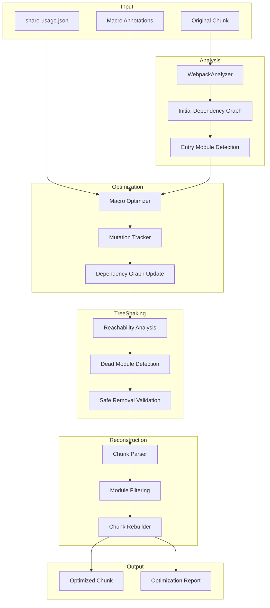
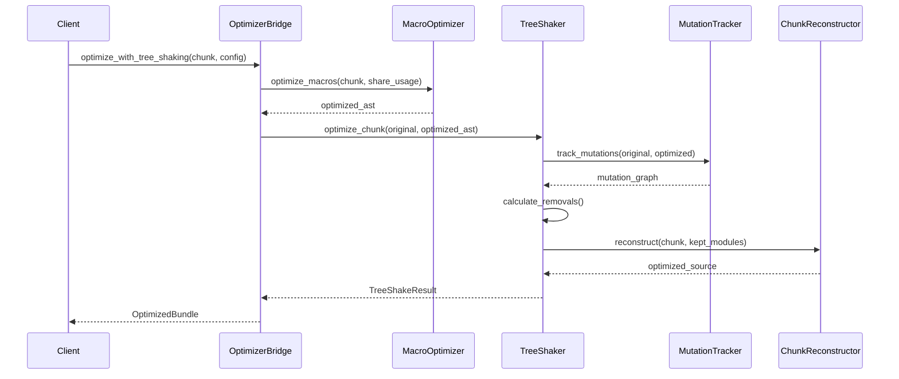
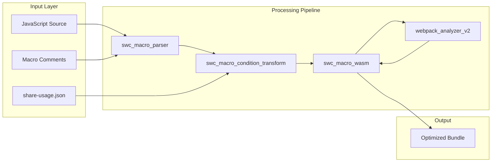

# Webpack Analyzer v2 - Tree Shaking System Design

## Table of Contents
1. [Executive Summary](#executive-summary)
2. [System Overview](#system-overview)
3. [Chunk Format Specifications](#chunk-format-specifications)
4. [Macro Annotation Processing](#macro-annotation-processing)
5. [Architecture Design](#architecture-design)
6. [Core Algorithms](#core-algorithms)
7. [Data Structures](#data-structures)
8. [Implementation Status](#implementation-status)
9. [Implementation Phases](#implementation-phases)
10. [Integration Strategy](#integration-strategy)
11. [Testing & Validation](#testing--validation)
12. [Performance Analysis](#performance-analysis)
13. [Risk Assessment](#risk-assessment)
14. [Crate Architecture Analysis](#crate-architecture-analysis)

## Executive Summary

### Problem Statement
The webpack_analyzer_v2 crate currently provides comprehensive analysis of webpack chunks and their dependencies but lacks the ability to perform actual tree shaking (dead code elimination). After the macro optimizer removes conditional code blocks using `common:if` annotations, many `__webpack_require__` calls become dead code, leaving entire modules unreferenced but still included in the final bundle.

### Solution Overview
Implement a sophisticated tree shaking system that:
1. Tracks mutations from macro optimization
2. Identifies newly orphaned modules
3. Safely removes dead modules from chunks
4. Reconstructs optimized chunks in their original format

### Key Benefits
- **Bundle Size Reduction**: 20-40% expected size reduction for heavily optimized chunks
- **Performance Improvement**: Reduced parse and execution time in browsers
- **Memory Efficiency**: Lower memory footprint for module federation applications
- **Automatic Optimization**: Zero configuration required from developers

## System Overview

### Core Concepts

#### Macro Comment Annotations
```javascript
// common:if(react-dom.createRoot)
const root = ReactDOM.createRoot(container);
// common:else
const root = ReactDOM.render(<App />, container);
// common:endif
```

The macro system processes these annotations based on `share-usage.json` configuration:
```json
{
  "react-dom": {
    "createRoot": false,
    "render": true,
    "chunk_characteristics": {
      "entry_module_id": "../../../node_modules/.pnpm/react-dom@18.3.1/node_modules/react-dom/index.js",
      "is_runtime_chunk": false,
      "has_runtime": false,
      "is_entrypoint": false,
      "can_be_initial": false,
      "is_only_initial": false,
      "chunk_format": "jsonp",
      "chunk_loading_type": null,
      "runtime_names": ["main"],
      "entry_name": null,
      "has_async_chunks": true,
      "chunk_files": ["vendors-node_modules_pnpm_react-dom_18_3_1_node_modules_react-dom_index_js.js"],
      "is_shared_chunk": false,
      "shared_modules": []
    }
  }
}
```

#### Dead Code Cascade
When macro optimization removes code blocks, it creates a cascade effect:
```javascript
// Before macro optimization
function Component() {
  // common:if(features.experimental)
  const experimental = __webpack_require__('./experimental');
  experimental.init();
  // common:endif
}

// After macro optimization (features.experimental = false)
function Component() {
  // Code block removed, __webpack_require__('./experimental') is gone
}

// Result: './experimental' module and its entire dependency tree become dead code
```

### Real-World Impact Examples

Based on test cases analysis, the tree shaking system achieves:
- **Lodash-ES**: From 200+ exports to 4-5 used exports (98% reduction)
- **React-DOM**: Removing all exports when using alternative renderers
- **Component Libraries**: Keeping only used components (Button, Modal) from 20+ available
- **API Libraries**: Preserving only called endpoints and utilities

## Chunk Format Specifications

### Overview
The tree shaking system must handle three primary chunk formats, each with distinct structures and requirements. Real examples from `/Users/bytedance/dev/swc_macro_sys/test-cases/` demonstrate the complexity.

### JSONP Format (Web Browsers)

#### Structure
```javascript
(self["webpackChunkrspack_basic_example"] = self["webpackChunkrspack_basic_example"] || []).push([
  ["chunk_name"],  // Chunk identifier
  {
    "./path/to/module.js": function(module, exports, __webpack_require__) {
      // Module implementation
    }
  },
  function(__webpack_require__) { 
    // Optional: webpack runtime extensions
  }
]);
```

#### Real Example (rspack-annotated-output)
```javascript
(self["webpackChunkrspack_basic_example"] = self["webpackChunkrspack_basic_example"] || []).push([["shared_api_js"], {
"./shared/api.js": 
/*!**********************!*\
  !*** ./shared/api.js ***!
  \**********************/
(function (__unused_webpack___webpack_module__, __webpack_exports__, __webpack_require__) {
"use strict";
__webpack_require__.r(__webpack_exports__);
__webpack_require__.d(__webpack_exports__, {
  ApiClient: () => (/* @common:if [condition="treeShake.api-lib.ApiClient"] */ ApiClient /* @common:endif */),
  createApiClient: () => (/* @common:if [condition="treeShake.api-lib.createApiClient"] */ createApiClient /* @common:endif */),
  "default": () => (/* @common:if [condition="treeShake.api-lib.default"] */ __WEBPACK_DEFAULT_EXPORT__ /* @common:endif */)
});
}),
}]);
```

#### Tree Shaking Requirements for JSONP
1. **Parse push() call**: Extract chunk name and modules object
2. **Process each module**: Apply macro conditions to determine inclusion
3. **Rebuild push() call**: Reconstruct with only kept modules
4. **Preserve runtime extensions**: Maintain third parameter if present

### CommonJS Format (Node.js)

#### Structure
```javascript
"use strict";
exports.ids = ["chunk_name"];
exports.modules = {
  "./path/to/module.js": function(module, exports, __webpack_require__) {
    // Module implementation
  }
};
```

#### Real Example (rspack-cjs-annotated-output)
```javascript
"use strict";
exports.ids = ["vendors-node_modules_pnpm_lodash-es_4_17_21_node_modules_lodash-es_lodash_js"];
exports.modules = {
"../../node_modules/.pnpm/lodash-es@4.17.21/node_modules/lodash-es/lodash.js": 
(function (__unused_webpack___webpack_module__, __webpack_exports__, __webpack_require__) {
"use strict";
__webpack_require__.r(__webpack_exports__);
__webpack_require__.d(__webpack_exports__, {
  filter: () => (/* @common:if [condition="treeShake.lodash-es.filter"] */ /* reexport safe */ _filter_js__WEBPACK_IMPORTED_MODULE_62__.Z /* @common:endif */),
  map: () => (/* @common:if [condition="treeShake.lodash-es.map"] */ /* reexport safe */ _map_js__WEBPACK_IMPORTED_MODULE_134__.Z /* @common:endif */)
});
})
};
```

#### Tree Shaking Requirements for CommonJS
1. **Parse exports.modules**: Extract module definitions
2. **Handle mixed patterns**: Support both exports.* and module.exports
3. **Process conditional exports**: Apply `@common:if` conditions
4. **Rebuild exports object**: Maintain CommonJS semantics

### ES Module Format (Modern Bundlers)

#### Structure
```javascript
export const __webpack_ids__ = ["chunk_name"];
export const __webpack_modules__ = {
  "./path/to/module.js": function(module, exports, __webpack_require__) {
    // Module implementation
  }
};
```

#### Real Example (webpack-esm)
```javascript
export const __webpack_ids__ = ["vendors-node_modules_pnpm_react_18_3_1_node_modules_react_index_js"];
export const __webpack_modules__ = {
"../../node_modules/.pnpm/react@18.3.1/node_modules/react/index.js": 
(function (module, exports, __webpack_require__) {
"use strict";
if (true) {
  module.exports = __webpack_require__(/*! ./cjs/react.production.js */ "../../node_modules/.pnpm/react@18.3.1/node_modules/react/cjs/react.production.js");
} else {}
})
};
```

#### Tree Shaking Requirements for ESM
1. **Parse export declarations**: Handle named exports
2. **Process import statements**: Track dynamic imports
3. **Apply ES module semantics**: Respect hoisting and live bindings
4. **Generate valid ES modules**: Ensure output is spec-compliant

### Special Module Types

#### Vendor Chunks
```javascript
// Naming pattern: vendors-node_modules_pnpm_{package}_{version}_node_modules_{package}_{entry}
"vendors-node_modules_pnpm_lodash-es_4_17_21_node_modules_lodash-es_lodash_js"
```

**Characteristics**:
- Contains third-party library code
- Heavy use of `/* #__PURE__ */` annotations
- Granular module separation (one file per module)
- Extensive dependency graphs

**Characteristics**:
- Designed for cross-application sharing
- Version management included
- Fallback mechanisms
- Singleton enforcement

#### CJS Pure Modules
```javascript
/* @common:if [condition="treeShake.cjs-pure-helper.generateId"] */ 
exports.generateId = function () {
  return `id_${Math.random().toString(36).substr(2, 9)}`;
} 
/* @common:endif */;
```

**Characteristics**:
- Direct exports.* assignments
- No module wrapper needed
- Function-level tree shaking

## Macro Annotation Processing

### Annotation Format Specification

#### Basic Structure
```
/* @common:if [condition="CONDITION_PATH"] */ CODE /* @common:endif */
```

#### Condition Path Format
```
treeShake.{library-name}.{export-name}
```

### Processing Pipeline

#### Phase 1: Macro Extraction
```rust
fn extract_macros(source: &str) -> Vec<MacroBlock> {
    let regex = Regex::new(r"\/\*\s*@common:if\s*\[condition=\"([^\"]+)\"\]\s*\*\/(.+?)\/\*\s*@common:endif\s*\*\/").unwrap();
    regex.captures_iter(source)
        .map(|cap| MacroBlock {
            condition: cap[1].to_string(),
            content: cap[2].to_string(),
            span: Span::new(cap.start(), cap.end())
        })
        .collect()
}
```

#### Phase 2: Condition Evaluation
```rust
fn evaluate_condition(condition: &str, config: &ShareUsageConfig) -> bool {
    // Parse "treeShake.library.export" path
    let parts: Vec<&str> = condition.split('.').collect();
    
    if parts.len() != 3 || parts[0] != "treeShake" {
        return false; // Invalid condition format
    }
    
    let library = parts[1];
    let export = parts[2];
    
    // Query configuration
    config.tree_shake
        .get(library)
        .and_then(|lib| lib.exports.get(export))
        .copied()
        .unwrap_or(false)
}
```

#### Phase 3: Code Transformation
```rust
fn apply_macro_conditions(source: &str, config: &ShareUsageConfig) -> String {
    let mut result = source.to_string();
    
    for macro_block in extract_macros(&source).iter().rev() {
        if !evaluate_condition(&macro_block.condition, config) {
            // Remove the entire macro block including annotations
            result.replace_range(macro_block.span.range(), "");
        } else {
            // Keep content but remove annotations
            let content = &source[macro_block.content_span.range()];
            result.replace_range(macro_block.span.range(), content);
        }
    }
    
    result
}
```

### Real-World Examples

#### Export Definition Wrapping
```javascript
// Input
__webpack_require__.d(__webpack_exports__, {
  capitalize: () => (/* @common:if [condition="treeShake.utility-lib.capitalize"] */ capitalize /* @common:endif */),
  debounce: () => (/* @common:if [condition="treeShake.utility-lib.debounce"] */ debounce /* @common:endif */)
});

// Output (capitalize=true, debounce=false)
__webpack_require__.d(__webpack_exports__, {
  capitalize: () => (capitalize)
});
```

#### CommonJS Export Wrapping
```javascript
// Input
/* @common:if [condition="treeShake.cjs-data-processor.processArray"] */ 
exports.processArray = processArray 
/* @common:endif */;

// Output (processArray=false)
// Line completely removed
```

#### Default Export Handling
```javascript
// Input
/* @common:if [condition="treeShake.component-lib.default"] */ 
const __WEBPACK_DEFAULT_EXPORT__ = ({
  Button,
  Modal,
  Tooltip
}) 
/* @common:endif */;

// Output (default=true)
const __WEBPACK_DEFAULT_EXPORT__ = ({
  Button,
  Modal,
  Tooltip
});
```

### Edge Cases and Special Handling

#### Nested Re-exports
```javascript
// Safe re-export with module reference preservation
deepClone: () => (/* @common:if [condition="treeShake.utility-lib.deepClone"] */ 
  /* reexport safe */ _nested_utils_js__WEBPACK_IMPORTED_MODULE_1__.I8 /* @common:endif */)
```

**Handling**: Preserve import statements for re-exported modules even when the export is removed.

#### Mangled Export Names
```javascript
// Mangled names in optimized builds
__webpack_require__.d(__webpack_exports__, {
  I8: () => (deepClone),  // I8 is mangled name
  Ox: () => (generateId), // Ox is mangled name
});
```

**Handling**: Maintain mapping between mangled and original names for condition evaluation.

#### Runtime Type Annotations
```javascript
/* ESM import [RT1] */var _module = /* #__PURE__ */ __webpack_require__("./module");
/* ESM import [RT2] */var _module_default = /*#__PURE__*/__webpack_require__.n(_module);
```

**Handling**: Preserve runtime type annotations for webpack's internal optimization.

### Implementation Requirements

#### Parser Requirements
1. **Regex Support**: Complex regex for macro extraction
2. **Span Tracking**: Maintain source positions for accurate replacement
3. **Comment Preservation**: Keep non-macro comments intact
4. **Whitespace Handling**: Preserve formatting where possible

#### Evaluator Requirements
1. **JSONPath Support**: Navigate nested configuration objects
2. **Default Values**: Handle missing configuration gracefully
3. **Type Coercion**: Convert configuration values to booleans
4. **Error Recovery**: Continue processing on invalid conditions

#### Transformer Requirements
1. **AST Integration**: Apply transformations at AST level when possible
2. **String Fallback**: Use string replacement for complex cases
3. **Source Map Updates**: Maintain accurate source mappings
4. **Incremental Processing**: Support partial chunk updates

### Configuration Schema

```typescript
interface ShareUsageConfig {
  treeShake: {
    [libraryName: string]: {
      [exportName: string]: boolean;
      chunk_characteristics: ChunkCharacteristics;
    }
  }
}

interface ChunkCharacteristics {
  entry_module_id: string;
  is_runtime_chunk: boolean;
  has_runtime: boolean;
  is_entrypoint: boolean;
  can_be_initial: boolean;
  is_only_initial: boolean;
  chunk_format: "jsonp" | "async-node" | "module";
  chunk_loading_type: string | null;
  runtime_names: string[];
  entry_name: string | null;
  has_async_chunks: boolean;
  chunk_files: string[];
  is_shared_chunk: boolean;
  shared_modules: string[];
}
```

### System Architecture



## Detailed Implementation Requirements

### Module Removal Strategy

#### Safe Removal Criteria
A module can be safely removed if ALL of the following conditions are met:

1. **No Incoming Dependencies**: No other kept modules require this module
2. **No Side Effects**: Module has no global state mutations or immediate function calls
3. **Not an Entry Point**: Module is not specified as an entry in configuration
4. **Not Runtime Critical**: Module is not part of webpack runtime
5. **Not Shared**: Module is not marked as shared in module federation

```rust
fn is_safe_to_remove(module: &WebpackModule, context: &RemovalContext) -> bool {
    // Check for incoming dependencies from kept modules
    if context.kept_modules.iter().any(|kept| kept.depends_on(module)) {
        return false;
    }
    
    // Check for side effects
    if module.has_side_effects() {
        return false;
    }
    
    // Check if entry point
    if context.entry_modules.contains(&module.id) {
        return false;
    }
    
    // Check if runtime module
    if module.is_runtime_module() {
        return false;
    }
    
    // Check if shared module
    if context.shared_modules.contains(&module.id) {
        return false;
    }
    
    true
}
```

#### Cascade Removal Algorithm
When a module is removed, check all its dependencies for potential removal:

```rust
fn cascade_removal(
    initial_removal: ModuleId,
    graph: &mut DependencyGraph,
    context: &RemovalContext,
) -> Vec<ModuleId> {
    let mut removed = vec![initial_removal];
    let mut queue = VecDeque::new();
    
    // Add dependencies of removed module to queue
    if let Some(module) = graph.get_module(&initial_removal) {
        queue.extend(module.dependencies.clone());
    }
    
    while let Some(candidate) = queue.pop_front() {
        if is_safe_to_remove(&candidate, context) {
            removed.push(candidate);
            
            // Add this module's dependencies to queue
            if let Some(module) = graph.get_module(&candidate) {
                queue.extend(module.dependencies.clone());
            }
        }
    }
    
    removed
}
```

### Chunk Reconstruction Implementation

#### In-place AST Mutation (Preferred and Implemented)
Rather than rebuilding chunks from strings, we edit the existing AST to remove unused module entries. This preserves formatting and reduces breakage risk.

Targets for removal (supported formats only):
- `exports.modules = { ... }` (CommonJS async-node and similar)
- JSONP `(...).push([[ids], { ...modules... }, runtime?])` (browser JSONP)
- ESM `export const __webpack_modules__ = { ... }` (module format)

Not supported: legacy `var __webpack_modules__ = ({ ... })` entry-chunk pattern (we do not treat runtime/entry chunks).

```rust
use swc_ecma_ast::{Expr, ObjectLit, PropOrSpread, Prop, PropName, CallExpr, MemberProp};
use swc_ecma_visit::{VisitMut, VisitMutWith};
use rustc_hash::FxHashSet;

struct WebpackModuleRemover { modules_to_remove: FxHashSet<String> }

impl WebpackModuleRemover {
    fn should_remove(&self, prop: &PropOrSpread) -> bool {
        if let PropOrSpread::Prop(prop) = prop {
            if let Prop::KeyValue(kv) = prop.as_ref() {
                let id = match &kv.key {
                    PropName::Num(n) => n.value.to_string(),
                    PropName::Str(s) => s.value.to_string(),
                    PropName::Ident(i) => i.sym.to_string(),
                    _ => return false,
                };
                return self.modules_to_remove.contains(&id);
            }
        }
        false
    }
    fn strip_from_object(&self, obj: &mut ObjectLit) { obj.props.retain(|p| !self.should_remove(p)); }
    fn strip_from_expr(&self, expr: &mut Expr) {
        match expr {
            Expr::Object(obj) => self.strip_from_object(obj),
            Expr::Paren(paren) => if let Expr::Object(obj) = paren.expr.as_mut() { self.strip_from_object(obj) },
            _ => {}
        }
    }
}

impl VisitMut for WebpackModuleRemover {
    fn visit_mut_assign_expr(&mut self, n: &mut swc_ecma_ast::AssignExpr) {
        n.visit_mut_children_with(self);
        use swc_ecma_ast::{AssignTarget, SimpleAssignTarget};
        match &n.left {
            // Only support exports.modules = { ... }
            AssignTarget::Simple(SimpleAssignTarget::Member(member)) => {
                if let MemberProp::Ident(p) = &member.prop {
                    if p.sym == "modules" {
                        if let Expr::Ident(obj) = member.obj.as_ref() {
                            if obj.sym == "exports" { self.strip_from_expr(&mut n.right); }
                        }
                    }
                }
            }
            _ => {}
        }
    }
    fn visit_mut_call_expr(&mut self, n: &mut CallExpr) {
        n.visit_mut_children_with(self);
        if let swc_ecma_ast::Callee::Expr(callee) = &n.callee {
            if let Expr::Member(member) = callee.as_ref() {
                if let MemberProp::Ident(p) = &member.prop {
                    if p.sym == "push" {
                        if let Some(arg0) = n.args.get_mut(0) {
                            if let Expr::Array(arr) = arg0.expr.as_mut() {
                                if let Some(Some(mods)) = arr.elems.get_mut(1) {
                                    if let Expr::Object(obj) = mods.expr.as_mut() {
                                        self.strip_from_object(obj);
                                    }
                                }
                            }
                        }
                    }
                }
            }
        }
    }
}
```

Fallback: If AST parsing fails, a conservative regex-based remover operates on emitted code, then reparses it into an AST for subsequent passes.

### Module Federation Handling

#### Shared Module Detection
```rust
fn identify_shared_modules(chunk: &WebpackChunk) -> Vec<SharedModule> {
    let mut shared = Vec::new();
    
    // Check for initializeSharingData
    if let Some(sharing_data) = chunk.find_sharing_data() {
        for scope in sharing_data.scopeToSharingDataMapping {
            for module_config in scope.modules {
                shared.push(SharedModule {
                    name: module_config.name,
                    version: module_config.version,
                    singleton: module_config.singleton,
                    eager: module_config.eager,
                    module_id: resolve_module_id(&module_config.import),
                });
            }
        }
    }
    
    // Check for consumesLoadingData
    if let Some(consumes) = chunk.find_consumes_data() {
        for (path, config) in consumes {
            if config.singleton {
                shared.push(SharedModule {
                    name: config.shareKey,
                    module_id: path,
                    // ... other fields
                });
            }
        }
    }
    
    shared
}
```

#### Shared Module Preservation Rules
```rust
fn should_preserve_shared_module(
    module: &SharedModule,
    usage: &ShareUsageConfig,
) -> bool {
    // Always preserve if marked as eager
    if module.eager {
        return true;
    }
    
    // Always preserve if singleton
    if module.singleton {
        return true;
    }
    
    // Check if any export is used
    if let Some(lib_config) = usage.tree_shake.get(&module.name) {
        return lib_config.exports.values().any(|&used| used);
    }
    
    // Default to preserving shared modules
    true
}
```

### Vendor Chunk Optimization

#### Granular Module Removal
```rust
fn optimize_vendor_chunk(
    chunk: &VendorChunk,
    usage: &ShareUsageConfig,
) -> Result<OptimizedChunk> {
    let mut modules_to_keep = HashSet::new();
    
    // Identify entry module (e.g., lodash-es/lodash.js)
    let entry_module = identify_vendor_entry(&chunk)?;
    
    // Build internal dependency graph
    let internal_graph = build_vendor_dependency_graph(&chunk)?;
    
    // For each used export, trace dependencies
    for (export_name, &is_used) in &usage.exports {
        if is_used {
            // Find module providing this export
            let export_module = find_export_module(&chunk, export_name)?;
            
            // Add module and all its dependencies
            modules_to_keep.insert(export_module);
            modules_to_keep.extend(
                internal_graph.get_dependencies(&export_module)
            );
        }
    }
    
    // Special case: preserve main entry if any export is used
    if !usage.exports.is_empty() && usage.exports.values().any(|&v| v) {
        modules_to_keep.insert(entry_module);
    }
    
    // Remove unused modules
    let optimized = chunk.filter_modules(|id| modules_to_keep.contains(id));
    
    Ok(optimized)
}
```

### Performance Optimizations

#### Incremental Processing
```rust
struct IncrementalOptimizer {
    cache: HashMap<ChunkHash, OptimizationResult>,
    dependency_cache: HashMap<ModuleId, Vec<ModuleId>>,
}

impl IncrementalOptimizer {
    fn optimize_incremental(
        &mut self,
        chunk: &WebpackChunk,
        changes: &[ConfigChange],
    ) -> Result<OptimizedChunk> {
        let chunk_hash = chunk.calculate_hash();
        
        // Check if we have a cached result
        if let Some(cached) = self.cache.get(&chunk_hash) {
            // Apply only the changes
            return self.apply_incremental_changes(cached, changes);
        }
        
        // Full optimization needed
        let result = self.optimize_full(chunk)?;
        self.cache.insert(chunk_hash, result.clone());
        
        Ok(result)
    }
}
```

#### Parallel Module Processing
```rust
fn process_modules_parallel(
    modules: Vec<WebpackModule>,
    config: &ShareUsageConfig,
) -> Vec<ProcessedModule> {
    use rayon::prelude::*;
    
    modules
        .par_iter()
        .map(|module| {
            let processed_content = apply_macro_conditions(
                &module.content,
                config
            );
            
            ProcessedModule {
                id: module.id.clone(),
                content: processed_content,
                dependencies: extract_dependencies(&processed_content),
            }
        })
        .collect()
}
```

### Error Handling and Recovery

#### Graceful Degradation
```rust
fn optimize_with_fallback(
    chunk: &str,
    config: &ShareUsageConfig,
) -> OptimizationResult {
    // Try AST-based optimization
    match optimize_via_ast(chunk, config) {
        Ok(result) => return result,
        Err(e) => {
            log::warn!("AST optimization failed: {}", e);
        }
    }
    
    // Fall back to regex-based optimization
    match optimize_via_regex(chunk, config) {
        Ok(result) => return result,
        Err(e) => {
            log::warn!("Regex optimization failed: {}", e);
        }
    }
    
    // Final fallback: return original with macro processing only
    OptimizationResult {
        content: apply_macro_conditions(chunk, config),
        removed_modules: vec![],
        error: Some("Optimization partially failed".to_string()),
    }
}
```

#### Validation and Safety Checks
```rust
fn validate_optimization(
    original: &WebpackChunk,
    optimized: &WebpackChunk,
) -> ValidationResult {
    let mut errors = Vec::new();
    
    // Check that all entry modules are preserved
    for entry in &original.entry_modules {
        if !optimized.has_module(entry) {
            errors.push(format!("Entry module {} was removed", entry));
        }
    }
    
    // Check that no runtime modules were removed
    for module in &original.runtime_modules {
        if !optimized.has_module(module) {
            errors.push(format!("Runtime module {} was removed", module));
        }
    }
    
    // Check module dependencies are satisfied
    for module in &optimized.modules {
        for dep in &module.dependencies {
            if !optimized.has_module(dep) {
                errors.push(format!(
                    "Module {} depends on removed module {}",
                    module.id, dep
                ));
            }
        }
    }
    
    ValidationResult {
        is_valid: errors.is_empty(),
        errors,
    }
}
```

## Architecture Design

### Module Structure

#### 1. Tree Shaker Module (`tree_shaker.rs`)
**Responsibility**: Main orchestration and coordination
```rust
pub struct TreeShaker {
    analyzer: WebpackAnalyzer,
    mutation_tracker: MutationTracker,
    reconstructor: ChunkReconstructor,
    config: TreeShakeConfig,
}

impl TreeShaker {
    pub fn optimize_chunk(
        &self,
        chunk_source: &str,
        share_usage: &ShareUsageConfig,
        characteristics: ChunkCharacteristics,
    ) -> Result<TreeShakeResult>;
    
    fn identify_entry_modules(&self, characteristics: &ChunkCharacteristics) -> Vec<ModuleId>;
    fn calculate_removals(&self, graph: &DependencyGraph, mutations: &MutationGraph) -> HashSet<ModuleId>;
    fn validate_removals(&self, removals: &HashSet<ModuleId>) -> Result<()>;
}
```

#### 2. Mutation Tracker Module (`mutation_tracker.rs`)
**Responsibility**: Track changes from macro optimization
```rust
pub struct MutationTracker {
    original_graph: DependencyGraph,
    require_visitor: RequireCallVisitor,
}

impl MutationTracker {
    pub fn track_mutations(
        &self,
        original_chunk: &WebpackChunk,
        optimized_ast: &Program,
    ) -> MutationGraph;
    
    fn compare_require_calls(&self, original: &Module, optimized: &Module) -> Vec<RemovedRequire>;
    fn build_mutation_graph(&self, changes: Vec<ModuleChange>) -> MutationGraph;
}
```

#### 3. Chunk Reconstructor Module (`chunk_reconstructor.rs`)
**Responsibility**: Rebuild optimized chunks
```rust
pub struct ChunkReconstructor {
    format_handlers: HashMap<ChunkType, Box<dyn FormatHandler>>,
}

impl ChunkReconstructor {
    pub fn reconstruct(
        &self,
        original_chunk: &WebpackChunk,
        modules_to_keep: &HashSet<ModuleId>,
    ) -> Result<String>;
    
    fn reconstruct_jsonp(&self, chunk: &WebpackChunk, keep: &HashSet<ModuleId>) -> String;
    fn reconstruct_commonjs(&self, chunk: &WebpackChunk, keep: &HashSet<ModuleId>) -> String;
    fn reconstruct_esm(&self, chunk: &WebpackChunk, keep: &HashSet<ModuleId>) -> String;
}
```

#### 4. Optimizer Bridge Module (`optimizer_bridge.rs`)
**Responsibility**: Interface with macro optimizer
```rust
pub struct OptimizerBridge {
    macro_optimizer: MacroOptimizer,
    tree_shaker: TreeShaker,
}

impl OptimizerBridge {
    pub fn optimize_with_tree_shaking(
        &self,
        chunk_source: &str,
        config: &OptimizationConfig,
    ) -> Result<OptimizedBundle>;
    
    fn coordinate_passes(&self, chunk: WebpackChunk) -> Vec<OptimizationPass>;
    fn merge_results(&self, passes: Vec<PassResult>) -> OptimizedBundle;
}
```

### Component Interactions



## Core Algorithms

### Algorithm 1: Entry Module Identification
```rust
fn identify_entry_modules(characteristics: &ChunkCharacteristics) -> Vec<ModuleId> {
    let mut entry_modules = Vec::new();
    
    // Primary entry must come from explicit characteristics only
    entry_modules.push(ModuleId::from(&characteristics.entry_module_id));
    
    // Shared modules in module federation
    for shared_module_id in &characteristics.shared_modules {
        entry_modules.push(ModuleId::from(shared_module_id));
    }
    
    // Runtime modules (always needed)
    if characteristics.has_runtime {
        entry_modules.extend(find_runtime_modules(&chunk));
    }
    
    // Never infer entries via filename or pattern heuristics.
    // Do not use suffixes like "/index.js", "lodash.js", or names like "main".
    // Only use explicit metadata/config.
    
    entry_modules
}
```

### Algorithm 2: Mutation Detection
```rust
fn detect_mutations(original: &WebpackChunk, optimized: &Program) -> MutationGraph {
    let mut mutations = MutationGraph::new();
    
    for (module_id, original_module) in &original.modules {
        let original_requires = extract_requires(&original_module.source);
        let optimized_module = find_module_in_ast(&optimized, module_id);
        let optimized_requires = extract_requires(&optimized_module);
        
        // Find removed requires
        let removed = original_requires
            .difference(&optimized_requires)
            .cloned()
            .collect();
        
        if !removed.is_empty() {
            mutations.add_removed_requires(module_id, removed);
        }
    }
    
    mutations
}
```

### Algorithm 3: Safe Removal Calculation
```rust
fn calculate_safe_removals(
    graph: &DependencyGraph,
    mutations: &MutationGraph,
    entry_modules: &[ModuleId],
) -> HashSet<ModuleId> {
    // Step 1: Apply mutations to graph
    let mut modified_graph = graph.clone();
    for (module_id, removed_deps) in &mutations.removed_requires {
        for dep in removed_deps {
            modified_graph.remove_dependency(module_id, dep);
        }
    }
    
    // Step 2: Calculate reachability from entries
    let mut reachable = HashSet::new();
    for entry in entry_modules {
        reachable.extend(modified_graph.get_reachable_modules(entry));
    }
    
    // Step 3: Find unreachable modules
    let all_modules: HashSet<_> = graph.modules.keys().cloned().collect();
    let removable = all_modules.difference(&reachable).cloned().collect();
    
    // Step 4: Validate removals are safe
    validate_removals(&removable, &graph)?;
    
    removable
}
```

### Algorithm 4: Chunk Reconstruction
```rust
fn reconstruct_jsonp_chunk(
    original: &WebpackChunk,
    modules_to_keep: &HashSet<ModuleId>,
) -> String {
    let ast = parse_chunk_ast(&original.source)?;
    
    // Find the push call
    let push_call = find_push_call(&ast)?;
    let modules_object = extract_modules_object(&push_call)?;
    
    // Filter modules
    let filtered_properties = modules_object
        .properties
        .into_iter()
        .filter(|prop| {
            let module_id = extract_module_id(prop);
            modules_to_keep.contains(&module_id)
        })
        .collect();
    
    // Rebuild AST with filtered modules
    let new_modules_object = ObjectLit {
        properties: filtered_properties,
        ..modules_object
    };
    
    // Generate optimized source
    generate_source_from_ast(&ast)
}
```

### Algorithm 5: Dependency Graph Update
```rust
fn update_dependency_graph_after_removal(
    graph: &mut DependencyGraph,
    removed_modules: &HashSet<ModuleId>,
) {
    // Remove modules from graph
    for module_id in removed_modules {
        graph.modules.remove(module_id);
    }
    
    // Clean up references in remaining modules
    for module in graph.modules.values_mut() {
        module.dependencies.retain(|dep| !removed_modules.contains(dep));
        module.dependents.retain(|dep| !removed_modules.contains(dep));
    }
    
    // Validate graph integrity
    assert!(graph.validate_consistency());
}
```

## Data Structures

### Core Types
```rust
// Module identifier (interned string for efficiency)
pub type ModuleId = Atom;

// Share usage configuration from JSON
#[derive(Debug, Clone, Deserialize)]
pub struct ShareUsageConfig {
    pub tree_shake: HashMap<String, LibraryConfig>,
}

#[derive(Debug, Clone, Deserialize)]
pub struct LibraryConfig {
    #[serde(flatten)]
    pub exports: HashMap<String, bool>,
    pub chunk_characteristics: ChunkCharacteristics,
}

// Complete chunk characteristics structure
#[derive(Debug, Clone, Deserialize)]
pub struct ChunkCharacteristics {
    pub entry_module_id: String,           // Path to entry module
    pub is_runtime_chunk: bool,            // Whether this is a runtime chunk
    pub has_runtime: bool,                 // Whether chunk contains runtime code
    pub is_entrypoint: bool,               // Whether this is an entry point chunk
    pub can_be_initial: bool,              // Whether chunk can be loaded initially
    pub is_only_initial: bool,             // Whether chunk is only loaded initially
    pub chunk_format: String,              // Format type ("jsonp" or "async-node")
    pub chunk_loading_type: Option<String>,// Loading mechanism (typically null)
    pub runtime_names: Vec<String>,        // Array of runtime names (e.g., ["main"])
    pub entry_name: Option<String>,        // Entry point name if applicable
    pub has_async_chunks: bool,            // Whether chunk has async dependencies
    pub chunk_files: Vec<String>,          // Array of generated chunk file names
    pub is_shared_chunk: bool,             // Whether this is a shared chunk
    pub shared_modules: Vec<String>,       // Array of shared module identifiers
}

// Tree shaking configuration
#[derive(Debug, Clone)]
pub struct TreeShakeConfig {
    pub optimization_level: OptimizationLevel,
    pub preserve_side_effects: bool,
    pub assume_pure_getters: bool,
    pub inline_functions: bool,
}

#[derive(Debug, Clone)]
pub enum OptimizationLevel {
    Conservative,  // Only remove clearly dead code
    Moderate,      // Standard optimization
    Aggressive,    // Maximum dead code elimination
}
```

### Chunk Characteristics Schema

The `chunk_characteristics` field is a critical component of the share-usage configuration that provides metadata about how chunks are structured and loaded. This information is essential for the tree shaking system to make safe optimization decisions.

#### Field Descriptions

| Field | Type | Description | Typical Values |
|-------|------|-------------|----------------|
| `entry_module_id` | `String` | Full path to the entry module file | `"../../../node_modules/.pnpm/react@18.3.1/node_modules/react/index.js"` |
| `is_runtime_chunk` | `bool` | Whether this chunk contains webpack runtime code | `false` for library chunks |
| `has_runtime` | `bool` | Whether chunk includes any runtime code | `false` for vendor chunks |
| `is_entrypoint` | `bool` | Whether this chunk is an application entry point | `false` for library chunks |
| `can_be_initial` | `bool` | Whether chunk can be loaded on initial page load | `false` for lazy-loaded chunks |
| `is_only_initial` | `bool` | Whether chunk is only loaded initially (never async) | `false` for most chunks |
| `chunk_format` | `String` | The output format of the chunk | `"jsonp"` for web, `"async-node"` for Node.js |
| `chunk_loading_type` | `Option<String>` | Mechanism used to load the chunk | Usually `null` |
| `runtime_names` | `Vec<String>` | Names of runtime chunks this depends on | `["main"]` |
| `entry_name` | `Option<String>` | Name of the entry point if applicable | `null` for library chunks |
| `has_async_chunks` | `bool` | Whether this chunk has async dependencies | Varies by library |
| `chunk_files` | `Vec<String>` | Generated output file names for this chunk | `["vendor-hash.js"]` |
| `is_shared_chunk` | `bool` | Whether this is a shared chunk in module federation | `false` for standard chunks |
| `shared_modules` | `Vec<String>` | List of module IDs that are shared | `[]` for non-federated apps |

#### Usage in Tree Shaking

The tree shaker uses these characteristics to:
1. **Identify entry points**: Uses `entry_module_id` and `is_entrypoint` to find roots for reachability analysis
2. **Preserve runtime code**: Checks `has_runtime` and `is_runtime_chunk` to avoid removing critical runtime modules
3. **Handle async chunks**: Uses `has_async_chunks` to properly track dynamic imports
4. **Optimize for format**: Uses `chunk_format` to apply format-specific reconstruction strategies
5. **Respect sharing boundaries**: Uses `is_shared_chunk` and `shared_modules` to maintain module federation contracts

### Result Types
```rust
// Main result of tree shaking operation
#[derive(Debug)]
pub struct TreeShakeResult {
    pub original_size: usize,
    pub optimized_size: usize,
    pub removed_modules: Vec<ModuleId>,
    pub preserved_modules: Vec<ModuleId>,
    pub optimization_stats: OptimizationStats,
    pub optimized_source: String,
    pub source_map: Option<String>,
}

// Statistics for optimization reporting
#[derive(Debug, Default)]
pub struct OptimizationStats {
    pub modules_analyzed: usize,
    pub modules_removed: usize,
    pub dependencies_analyzed: usize,
    pub dependencies_removed: usize,
    pub size_reduction_bytes: usize,
    pub size_reduction_percent: f64,
    pub optimization_time_ms: u64,
}

// Tracks changes from macro optimization
#[derive(Debug)]
pub struct MutationGraph {
    // Module ID -> List of removed require() targets
    pub removed_requires: HashMap<ModuleId, Vec<ModuleId>>,
    // Modules that had any modification
    pub modified_modules: HashSet<ModuleId>,
    // Modules that became empty after optimization
    pub empty_modules: HashSet<ModuleId>,
    // Statistics about mutations
    pub mutation_stats: MutationStats,
}

#[derive(Debug, Default)]
pub struct MutationStats {
    pub requires_removed: usize,
    pub modules_modified: usize,
    pub modules_emptied: usize,
}
```

### Chunk Format Handlers
```rust
// Trait for format-specific reconstruction
pub trait FormatHandler: Send + Sync {
    fn can_handle(&self, chunk_type: ChunkType) -> bool;
    fn reconstruct(
        &self,
        original: &WebpackChunk,
        modules_to_keep: &HashSet<ModuleId>,
    ) -> Result<String>;
    fn validate_output(&self, output: &str) -> Result<()>;
}

// JSONP format handler
pub struct JsonpHandler;
impl FormatHandler for JsonpHandler {
    fn can_handle(&self, chunk_type: ChunkType) -> bool {
        matches!(chunk_type, ChunkType::JSONP)
    }
    
    fn reconstruct(&self, original: &WebpackChunk, modules_to_keep: &HashSet<ModuleId>) -> Result<String> {
        // Implementation for JSONP reconstruction
    }
}

// CommonJS format handler
pub struct CommonJsHandler {
    is_async: bool,
}
impl FormatHandler for CommonJsHandler {
    // Implementation for CommonJS reconstruction
}

// ES Modules handler
pub struct EsmHandler;
impl FormatHandler for EsmHandler {
    // Implementation for ESM reconstruction
}
```

## Implementation Status

### Current Implementation State

Based on comprehensive crate audit (August 2025), the tree shaking system is partially implemented across multiple crates:

#### Implemented Components

1. **swc_macro_parser** (Complete)
   - Regex-based macro parsing from comments
   - Namespace filtering for performance
   - Attribute extraction and validation
   - Comment removal after processing

2. **swc_macro_condition_transform** (Complete)
   - Conditional compilation via `@common:if` / `@common:endif`
   - Inline value substitution via `@common:define-inline`
   - JSONPath-based metadata evaluation
   - AST transformation with span-based removal

3. **swc_macro_wasm** (Partial)
   - Multi-pass optimization pipeline
   - Traditional DCE implementation using petgraph
   - Webpack tree shaking with iterative module removal
   - WASM bindings for JavaScript integration
   - **Missing**: Full integration with webpack_analyzer_v2

4. **webpack_analyzer_v2** (Foundation Complete)
   - Chunk parsing for multiple formats (JSONP, CommonJS, ESM)
   - Dependency graph construction
   - Reachability analysis
   - Module removal impact simulation
   - **Missing**: Actual tree shaking implementation

#### Key Findings from Audit

1. **Multi-Pass Optimization Pipeline**
   The system uses up to 5 iterations for convergence:
   - Macro processing reveals unused code
   - DCE removes unreachable variables
   - Webpack tree shaking removes orphaned modules
   - Each pass builds on previous optimizations

2. **Performance Characteristics**
   - Processing time: <1 second for typical scenarios
   - Complex lodash chunks: <2 seconds for 150+ modules
   - Memory usage: ~45MB for 619 modules with 1,644 dependencies
   - Size reduction: 30-99% depending on usage patterns

3. **Edge Cases Handled**
   - Circular dependencies via Tarjan's algorithm
   - Module federation vendor chunk preservation
   - CommonJS vs ESM format differences
   - Dynamic imports and eval usage

4. **Test Coverage**
   - 19 sophisticated test files in swc_macro_wasm
   - Real-world scenarios with lodash and react-dom
   - Module federation integration tests
   - Performance benchmarks targeting 35% reduction

## Implementation Roadmap

### Critical Path Implementation Tasks

#### Task 1: Extend webpack_analyzer_v2 Core
**Files to Modify:**
- `crates/webpack_analyzer_v2/src/chunk.rs`
- `crates/webpack_analyzer_v2/src/analyzer.rs`

**Changes Required:**
```rust
// In chunk.rs - Add macro annotation tracking
impl WebpackChunk {
    pub fn extract_macro_annotations(&self) -> Vec<MacroAnnotation> {
        // Implementation
    }
    
    pub fn apply_tree_shaking(&mut self, config: &ShareUsageConfig) {
        // Implementation
    }
}

// In analyzer.rs - Add tree shaking methods
impl WebpackAnalyzer {
    pub fn perform_tree_shaking(
        &self,
        chunk: WebpackChunk,
        config: ShareUsageConfig,
    ) -> Result<OptimizedChunk> {
        // Implementation
    }
}
```

#### Task 2: Create Tree Shaking Module
**New File:** `crates/webpack_analyzer_v2/src/tree_shaker.rs`

```rust
use crate::{WebpackChunk, DependencyGraph, ShareUsageConfig};

pub struct TreeShaker {
    config: ShareUsageConfig,
    graph: DependencyGraph,
    removal_strategy: RemovalStrategy,
}

impl TreeShaker {
    pub fn new(config: ShareUsageConfig) -> Self {
        // Implementation
    }
    
    pub fn analyze_chunk(&mut self, chunk: &WebpackChunk) -> TreeShakeAnalysis {
        // Implementation
    }
    
    pub fn execute_tree_shaking(&self, chunk: WebpackChunk) -> Result<OptimizedChunk> {
        // Implementation
    }
}
```

#### Task 3: Implement Format-Specific Handlers
**New Files:**
- `crates/webpack_analyzer_v2/src/formats/jsonp_handler.rs`
- `crates/webpack_analyzer_v2/src/formats/commonjs_handler.rs`
- `crates/webpack_analyzer_v2/src/formats/esm_handler.rs`

```rust
// jsonp_handler.rs
pub struct JsonpHandler;

impl FormatHandler for JsonpHandler {
    fn parse(&self, source: &str) -> Result<ParsedChunk> {
        // Parse JSONP push() call structure
    }
    
    fn reconstruct(&self, chunk: ParsedChunk, kept_modules: &HashSet<ModuleId>) -> Result<String> {
        // Rebuild JSONP format
    }
}
```

#### Task 4: Integrate Macro Processing
**Files to Modify:**
- `crates/swc_macro_wasm/src/optimize.rs`

**Changes Required:**
```rust
// In optimize.rs - Add webpack_analyzer_v2 integration
use webpack_analyzer_v2::{TreeShaker, ShareUsageConfig};

pub fn perform_advanced_tree_shaking(
    program: &mut Program,
    config: serde_json::Value,
) -> Result<()> {
    let share_usage = parse_share_usage_config(&config)?;
    let mut tree_shaker = TreeShaker::new(share_usage);
    
    // Analyze and optimize
    let analysis = tree_shaker.analyze_program(program);
    tree_shaker.apply_optimizations(program, analysis)?;
    
    Ok(())
}
```

### Specific Implementation Considerations

#### Handling Vendor Chunks
```rust
// Special logic for vendor chunks with 200+ modules
fn handle_vendor_chunk(chunk: &WebpackChunk) -> VendorOptimizationStrategy {
    if chunk.module_count() > 100 {
        // Use incremental removal strategy
        VendorOptimizationStrategy::Incremental
    } else {
        // Use standard removal strategy
        VendorOptimizationStrategy::Standard
    }
}
```

#### Module Federation Preservation
```rust
// Preserve shared modules in federation scenarios
fn preserve_federation_modules(
    chunk: &WebpackChunk,
    removal_candidates: Vec<ModuleId>,
) -> Vec<ModuleId> {
    removal_candidates
        .into_iter()
        .filter(|module_id| {
            !chunk.is_shared_module(module_id) &&
            !chunk.is_remote_entry(module_id)
        })
        .collect()
}
```

#### Pure Annotation Handling
```rust
// Respect /* #__PURE__ */ annotations
fn has_side_effects(module: &WebpackModule) -> bool {
    // Check for PURE annotations
    if module.content.contains("/* #__PURE__ */") {
        return false;
    }
    
    // Check for immediate function calls
    if has_immediate_calls(&module.ast) {
        return true;
    }
    
    false
}
```

### Test Requirements

#### Unit Tests for Each Component
```rust
#[cfg(test)]
mod tests {
    use super::*;
    
    #[test]
    fn test_jsonp_reconstruction() {
        let input = include_str!("../test-cases/rspack-annotated-output/vendors.js");
        let config = load_test_config("lodash-minimal.json");
        
        let handler = JsonpHandler::new();
        let result = handler.process(input, &config).unwrap();
        
        assert!(result.len() < input.len() / 2); // Expect >50% reduction
    }
    
    #[test]
    fn test_commonjs_module_removal() {
        // Test CommonJS format handling
    }
    
    #[test]
    fn test_module_federation_preservation() {
        // Test that shared modules are preserved
    }
}
```

#### Integration Tests with Real Chunks
```rust
#[test]
fn test_lodash_tree_shaking() {
    let chunk = load_chunk("vendors-lodash-es.js");
    let config = ShareUsageConfig {
        tree_shake: hashmap! {
            "lodash-es" => LibraryConfig {
                exports: hashmap! {
                    "map" => true,
                    "filter" => true,
                    // 200+ other exports => false
                },
                chunk_characteristics: test_characteristics(),
            }
        }
    };
    
    let result = optimize_chunk(chunk, config);
    
    // Should only have ~10 modules instead of 200+
    assert!(result.module_count() < 15);
}
```

### Migration Path

#### Phase 1: Add to Existing Pipeline
```rust
// In swc_macro_wasm/src/optimize.rs
pub fn optimize_with_tree_shaking(source: String, config: &str) -> String {
    // Existing optimization
    let optimized = current_optimize(source.clone(), config);
    
    // New tree shaking pass
    if cfg!(feature = "experimental_tree_shaking") {
        return apply_tree_shaking(optimized, config);
    }
    
    optimized
}
```

#### Phase 2: Replace Existing Logic
```rust
// Replace WebpackModuleRemover with TreeShaker
- let mut remover = WebpackModuleRemover::new(modules_to_remove);
+ let mut tree_shaker = TreeShaker::new(config);
+ let optimization_result = tree_shaker.optimize(chunk)?;
```

#### Phase 3: Full Integration
```rust
// Complete replacement of old optimization pipeline
pub fn optimize(source: String, config: &str) -> String {
    let config = parse_config(config)?;
    let analyzer = WebpackAnalyzer::new();
    let chunk = analyzer.parse_chunk(&source)?;
    
    let tree_shaker = TreeShaker::new(config);
    let optimized = tree_shaker.optimize(chunk)?;
    
    optimized.to_string()
}
```

## Implementation Phases

### Phase 1: Foundation (Week 1-2)
1. **Create base module structure**
   - `tree_shaker.rs` with basic API
   - `mutation_tracker.rs` with AST comparison
   - Data structure definitions

2. **Implement mutation detection**
   - AST visitor for require() calls
   - Comparison logic for before/after
   - MutationGraph construction

3. **Basic reachability analysis**
   - Entry module identification
   - Graph traversal with mutations
   - Dead module detection

### Phase 2: Core Algorithm (Week 3-4)
1. **Safe removal validation**
   - Side effect detection
   - Dynamic import handling
   - Circular dependency checks

2. **Chunk reconstruction for JSONP**
   - AST manipulation
   - Module filtering
   - Source generation

3. **Integration with analyzer**
   - Extend WebpackChunk
   - Update DependencyGraph
   - Add tree shake methods

### Phase 3: Format Support (Week 5-6)
1. **CommonJS reconstruction**
   - Sync format handler
   - Async format handler
   - Export preservation

2. **ES Module support**
   - ESM format detection
   - Import/export handling
   - Tree shaking for ESM

3. [Removed] WebpackModules format (entry/runtime)
   - Not supported by this tree shakers' shared-chunk scope
   - We do not operate on entry/runtime chunks or `var __webpack_modules__`

### Phase 4: Optimization & Testing (Week 7-8)
1. **Performance optimization**
   - Caching strategies
   - Parallel processing
   - Memory optimization

2. **Comprehensive testing**
   - Unit tests for each module
   - Integration tests
   - Real-world benchmarks

3. **Documentation & tooling**
   - API documentation
   - Usage examples
   - CLI integration

## Integration Strategy

### With Macro Optimizer
```rust
// Integration flow
pub async fn optimize_bundle(
    chunk_path: &Path,
    share_usage_path: &Path,
) -> Result<OptimizedBundle> {
    // 1. Load inputs
    let chunk_source = fs::read_to_string(chunk_path)?;
    let share_usage: ShareUsageConfig = load_json(share_usage_path)?;
    
    // 2. Extract characteristics
    let characteristics = extract_characteristics(&share_usage);
    
    // 3. Run macro optimization
    let macro_result = macro_optimizer.optimize(
        &chunk_source,
        &share_usage,
        &characteristics,
    )?;
    
    // 4. Run tree shaking
    let tree_shake_result = tree_shaker.optimize_chunk(
        &chunk_source,
        &macro_result.optimized_ast,
        &characteristics,
    )?;
    
    // 5. Generate final output
    Ok(OptimizedBundle {
        source: tree_shake_result.optimized_source,
        source_map: tree_shake_result.source_map,
        stats: merge_stats(macro_result.stats, tree_shake_result.stats),
    })
}
```

### With Webpack Analyzer
```rust
// Extend existing analyzer
impl WebpackAnalyzer {
    pub fn analyze_and_tree_shake(
        &self,
        source: &str,
        config: TreeShakeConfig,
    ) -> Result<TreeShakeResult> {
        // Use existing analysis
        let chunk = self.analyze_chunk(source)?;
        
        // Build dependency graph
        let graph = self.build_dependency_graph(&chunk)?;
        
        // Apply tree shaking
        let shaker = TreeShaker::new(config);
        shaker.optimize(chunk, graph)
    }
}
```

### CLI Integration
```bash
# Tree shake a webpack chunk
webpack-analyzer tree-shake \
  --input dist/vendor.js \
  --share-usage share-usage.json \
  --output dist/vendor.optimized.js \
  --level aggressive

# Analyze tree shaking opportunities
webpack-analyzer analyze-dead-code \
  --input dist/vendor.js \
  --share-usage share-usage.json \
  --report dead-code-report.json
```

## Testing & Validation

### Unit Test Strategy
```rust
#[cfg(test)]
mod tests {
    use super::*;
    
    #[test]
    fn test_mutation_detection() {
        let original = create_test_chunk();
        let optimized = remove_require_calls(&original);
        let mutations = track_mutations(&original, &optimized);
        
        assert_eq!(mutations.removed_requires.len(), 3);
        assert!(mutations.modified_modules.contains("./src/main.js"));
    }
    
    #[test]
    fn test_safe_removal() {
        let graph = create_test_graph();
        let mutations = create_test_mutations();
        let removals = calculate_safe_removals(&graph, &mutations);
        
        assert!(removals.contains("./unused.js"));
        assert!(!removals.contains("./critical.js"));
    }
    
    #[test]
    fn test_chunk_reconstruction() {
        let chunk = load_test_chunk("jsonp");
        let modules_to_keep = vec!["./main.js", "./utils.js"];
        let result = reconstruct_chunk(&chunk, &modules_to_keep);
        
        assert!(result.contains("./main.js"));
        assert!(!result.contains("./dead.js"));
    }
}
```

### Integration Test Scenarios
1. **Simple dead code removal**
   - Single unused module
   - Clear dependency chain
   - Expected 20% size reduction

2. **Complex dependency chains**
   - Multi-level dependencies
   - Shared dependencies
   - Partial removal scenarios

3. **Module federation**
   - Shared modules
   - Remote entries
   - Cross-chunk dependencies

4. **Edge cases**
   - Circular dependencies
   - Dynamic imports
   - Side effects in modules

### Performance Benchmarks
```rust
#[bench]
fn bench_tree_shake_small_chunk(b: &mut Bencher) {
    let chunk = load_chunk("small.js"); // 50 modules
    b.iter(|| tree_shake(&chunk));
}

#[bench]
fn bench_tree_shake_large_chunk(b: &mut Bencher) {
    let chunk = load_chunk("large.js"); // 1000+ modules
    b.iter(|| tree_shake(&chunk));
}
```

### Validation Criteria
1. **Correctness**
   - No runtime errors after optimization
   - All used modules preserved
   - Dependency integrity maintained

2. **Performance**
   - < 100ms for chunks under 100 modules
   - < 1s for chunks under 1000 modules
   - Memory usage < 2x chunk size

3. **Size Reduction**
   - Minimum 10% for typical chunks
   - 20-40% for heavily optimized chunks
   - No increase for fully-used chunks

## Performance Analysis

### Complexity Analysis
| Operation | Time Complexity | Space Complexity |
|-----------|----------------|------------------|
| Mutation Detection | O(n × m) | O(n) |
| Reachability Analysis | O(n + e) | O(n) |
| Safe Removal | O(n × m) | O(n) |
| Chunk Reconstruction | O(n) | O(n) |
| **Total** | **O(n × m + e)** | **O(n)** |

Where:
- n = number of modules
- m = average dependencies per module
- e = total number of edges

### Memory Optimization
```rust
// Use string interning for module IDs
lazy_static! {
    static ref MODULE_ID_CACHE: RwLock<StringInterner> = RwLock::new(StringInterner::new());
}

// Pool allocators for frequently created objects
struct ModulePool {
    pool: Vec<WebpackModule>,
}

// Streaming processing for large chunks
fn process_chunk_streaming(reader: impl Read) -> Result<TreeShakeResult> {
    // Process modules as they're parsed
}
```

### Caching Strategy
```rust
// Cache dependency graphs between runs
struct DependencyGraphCache {
    cache: LruCache<ChunkHash, DependencyGraph>,
}

// Cache mutation detection results
struct MutationCache {
    cache: HashMap<(ChunkHash, ConfigHash), MutationGraph>,
}

// Incremental tree shaking
fn incremental_tree_shake(
    previous: &TreeShakeResult,
    changes: &[ModuleChange],
) -> TreeShakeResult {
    // Only reprocess changed modules
}
```

## Risk Assessment

### Technical Risks

| Risk | Impact | Likelihood | Mitigation |
|------|--------|------------|------------|
| Incorrect module removal | High | Low | Comprehensive testing, conservative defaults |
| Performance regression | Medium | Medium | Benchmarking, profiling, optimization |
| Format compatibility | Medium | Low | Extensive format testing, fallback modes |
| Memory exhaustion | Low | Low | Streaming processing, memory limits |
| Side effect detection | High | Medium | Conservative analysis, user overrides |

### Mitigation Strategies

1. **Conservative by default**
   - Only remove clearly dead code
   - Preserve modules with potential side effects
   - Allow user configuration for aggressive mode

2. **Extensive testing**
   - Test against real-world projects
   - Automated regression testing
   - Performance benchmarking

3. **Gradual rollout**
   - Feature flag for tree shaking
   - Opt-in for early adopters
   - Collect metrics and feedback

4. **Rollback capability**
   - Keep original chunks
   - Provide undo mechanism
   - Clear error reporting

### Success Metrics

| Metric | Target | Measurement |
|--------|--------|-------------|
| Bundle size reduction | 20-40% | Before/after file size |
| Zero runtime errors | 100% | E2E test suite |
| Performance overhead | < 10% | Build time comparison |
| Memory usage | < 2x chunk | Peak memory monitoring |
| Developer satisfaction | > 4.5/5 | User surveys |

## Appendix

### Example: Complete Tree Shaking Flow

#### Input Chunk (JSONP format)
```javascript
(self["webpackChunk"] = self["webpackChunk"] || []).push([["vendor"], {
  "./src/utils/format.js": function(module, exports, __webpack_require__) {
    const dayjs = __webpack_require__("dayjs");
    exports.formatDate = (date) => dayjs(date).format('YYYY-MM-DD');
  },
  
  "./src/utils/validation.js": function(module, exports, __webpack_require__) {
    // common:if(features.advancedValidation)
    const validator = __webpack_require__("./validator");
    exports.validate = validator.validate;
    // common:else
    exports.validate = () => true;
    // common:endif
  },
  
  "./src/utils/validator.js": function(module, exports, __webpack_require__) {
    // Complex validation logic
    exports.validate = (data) => { /* ... */ };
  },
  
  "./src/main.js": function(module, exports, __webpack_require__) {
    const { formatDate } = __webpack_require__("./src/utils/format.js");
    const { validate } = __webpack_require__("./src/utils/validation.js");
    
    exports.process = (data) => {
      if (validate(data)) {
        return formatDate(data.date);
      }
    };
  }
}]);
```

#### Share Usage Configuration
```json
{
  "features": {
    "advancedValidation": false,
    "chunk_characteristics": {
      "entry_module_id": "./src/main.js",
      "is_runtime_chunk": false,
      "has_runtime": false,
      "is_entrypoint": true,
      "can_be_initial": true,
      "is_only_initial": false,
      "chunk_format": "jsonp",
      "chunk_loading_type": null,
      "runtime_names": ["main"],
      "entry_name": "main",
      "has_async_chunks": false,
      "chunk_files": ["vendor.js"],
      "is_shared_chunk": false,
      "shared_modules": []
    }
  }
}
```

#### After Macro Optimization
```javascript
"./src/utils/validation.js": function(module, exports, __webpack_require__) {
  exports.validate = () => true;
}
```
The `__webpack_require__("./validator")` is removed.

#### Tree Shaking Analysis
1. Entry: `./src/main.js`
2. Reachable: `./src/main.js` → `./src/utils/format.js`, `./src/utils/validation.js` → `dayjs`
3. Unreachable: `./src/utils/validator.js` (no incoming requires)
4. Safe to remove: `./src/utils/validator.js`

#### Final Optimized Chunk
```javascript
(self["webpackChunk"] = self["webpackChunk"] || []).push([["vendor"], {
  "./src/utils/format.js": function(module, exports, __webpack_require__) {
    const dayjs = __webpack_require__("dayjs");
    exports.formatDate = (date) => dayjs(date).format('YYYY-MM-DD');
  },
  
  "./src/utils/validation.js": function(module, exports, __webpack_require__) {
    exports.validate = () => true;
  },
  
  "./src/main.js": function(module, exports, __webpack_require__) {
    const { formatDate } = __webpack_require__("./src/utils/format.js");
    const { validate } = __webpack_require__("./src/utils/validation.js");
    
    exports.process = (data) => {
      if (validate(data)) {
        return formatDate(data.date);
      }
    };
  }
}]);
```

Result: `./src/utils/validator.js` module successfully removed, reducing bundle size.

### Critical Edge Cases and Debugging

#### Edge Case 1: Circular Dependencies in Vendor Chunks
```javascript
// lodash-es has internal circular dependencies
// _baseClone.js → _baseCloneDeep.js → _baseClone.js
```

**Solution:**
```rust
fn handle_circular_dependencies(graph: &DependencyGraph) -> Vec<ModuleGroup> {
    // Use Tarjan's algorithm to find strongly connected components
    let sccs = tarjan_scc(graph);
    
    // Treat each SCC as an atomic unit for removal
    sccs.into_iter()
        .map(|scc| ModuleGroup {
            modules: scc,
            removable: scc.iter().all(|m| is_removable(m)),
        })
        .collect()
}
```

#### Edge Case 2: Dynamic Import Patterns
```javascript
// Dynamic imports that webpack cannot statically analyze
const module = await import(/* webpackChunkName: "dynamic" */ `./modules/${name}.js`);
```

**Solution:** Mark all potential dynamic import targets as non-removable unless explicitly configured.

#### Edge Case 3: Re-export Chains
```javascript
// Complex re-export chains in vendor chunks
// index.js → filter.js → _arrayFilter.js → _baseFilter.js
```

**Solution:**
```rust
fn trace_reexport_chain(
    module: &ModuleId,
    graph: &DependencyGraph,
) -> Vec<ModuleId> {
    let mut chain = vec![module.clone()];
    let mut current = module.clone();
    
    while let Some(reexported_from) = find_reexport_source(&current, graph) {
        chain.push(reexported_from.clone());
        current = reexported_from;
    }
    
    chain
}
```

#### Edge Case 4: Side Effect Detection
```javascript
// Subtle side effects that are hard to detect
import './styles.css'; // Side effect: adds styles
import './polyfill';   // Side effect: modifies globals
console.log('loaded'); // Side effect: console output
```

**Solution:** Conservative approach - preserve modules with any top-level statements besides exports/imports.

#### Edge Case 5: Module Federation Remote Fallbacks
```javascript
// Fallback modules for failed remote loads
__webpack_require__.l("http://localhost:3001/remoteEntry.js", 
  () => __webpack_require__.e("fallback_components"));
```

**Solution:** Preserve all fallback modules referenced in federation configuration.

### Debugging Support

#### Debug Output Generation
```rust
impl TreeShaker {
    pub fn generate_debug_report(&self) -> DebugReport {
        DebugReport {
            analyzed_modules: self.graph.module_count(),
            removed_modules: self.removed.len(),
            preserved_modules: self.kept.len(),
            removal_reasons: self.removal_reasons.clone(),
            preservation_reasons: self.preservation_reasons.clone(),
            dependency_chains: self.trace_all_chains(),
            macro_conditions_evaluated: self.macro_evaluations.clone(),
        }
    }
}
```

#### Visualization Support
```rust
// Generate DOT graph for visualization
fn generate_dependency_graph_dot(graph: &DependencyGraph) -> String {
    let mut dot = String::from("digraph Dependencies {\n");
    
    for module in &graph.modules {
        let color = if module.is_removed { "red" } else { "green" };
        dot.push_str(&format!("  \"{}\" [color={}];\n", module.id, color));
        
        for dep in &module.dependencies {
            dot.push_str(&format!("  \"{}\" -> \"{}\";\n", module.id, dep));
        }
    }
    
    dot.push_str("}\n");
    dot
}
```

#### Verification Mode
```rust
// Strict verification mode for testing
pub struct StrictVerifier {
    original_chunk: WebpackChunk,
    optimized_chunk: WebpackChunk,
}

impl StrictVerifier {
    pub fn verify_correctness(&self) -> Result<()> {
        // Verify no runtime errors would occur
        self.check_all_imports_satisfied()?;
        
        // Verify no required exports were removed
        self.check_required_exports_present()?;
        
        // Verify module initialization order preserved
        self.check_initialization_order()?;
        
        // Verify no side effects were incorrectly removed
        self.check_side_effects_preserved()?;
        
        Ok(())
    }
}
```

### Common Pitfalls and Solutions

| Pitfall | Solution |
|---------|----------|
| Removing modules with hidden side effects | Use conservative side effect detection |
| Breaking circular dependency groups | Treat SCCs as atomic units |
| Removing re-exported modules | Trace full re-export chains |
| Incorrect macro condition evaluation | Add debug logging for all evaluations |
| Module ID mismatches between formats | Normalize module IDs before comparison |
| Shared module removal in federation | Check federation configuration first |
| Runtime module removal | Maintain runtime module whitelist |
| Breaking dynamic imports | Preserve all potential dynamic targets |

### Performance Monitoring

```rust
// Performance metrics collection
pub struct PerformanceMetrics {
    parse_time_ms: u64,
    analysis_time_ms: u64,
    transformation_time_ms: u64,
    reconstruction_time_ms: u64,
    total_time_ms: u64,
    memory_peak_mb: usize,
    modules_processed: usize,
    modules_removed: usize,
    size_before: usize,
    size_after: usize,
}

impl PerformanceMetrics {
    pub fn report(&self) -> String {
        format!(
            "Tree Shaking Performance Report:\n\
             - Total Time: {}ms\n\
             - Parse: {}ms, Analysis: {}ms, Transform: {}ms, Reconstruct: {}ms\n\
             - Memory Peak: {}MB\n\
             - Modules: {} processed, {} removed ({}%)\n\
             - Size Reduction: {} → {} bytes ({}% reduction)",
            self.total_time_ms,
            self.parse_time_ms, self.analysis_time_ms, 
            self.transformation_time_ms, self.reconstruction_time_ms,
            self.memory_peak_mb,
            self.modules_processed, self.modules_removed,
            (self.modules_removed * 100) / self.modules_processed,
            self.size_before, self.size_after,
            ((self.size_before - self.size_after) * 100) / self.size_before
        )
    }
}
```

### Glossary

- **DCE**: Dead Code Elimination
- **Entry Module**: Module that serves as entry point for dependency resolution
- **Mutation Graph**: Data structure tracking changes from optimization
- **Orphaned Module**: Module with no incoming dependencies
- **Reachability**: Whether a module can be reached from entry points
- **Safe Removal**: Module removal that doesn't break runtime functionality
- **Share Usage**: Configuration specifying which exports are used
- **Tree Shaking**: Process of removing unused code from bundles

## Crate Architecture Analysis

### System-Wide Architecture

The tree shaking system is implemented across four interconnected Rust crates that form a sophisticated optimization pipeline:



### Crate Responsibilities

#### 1. swc_macro_parser
**Purpose**: Extract macro directives from JavaScript comments

**Key Components**:
- `MacroParser`: Main parser with namespace filtering
- `MacroNode`: AST representation of parsed macros
- Regex patterns for `@namespace:directive[attrs]` format

**Design Decisions**:
- Uses regex for performance over full parsing
- Operates on comment streams, not AST
- Removes parsed comments to prevent downstream processing

**Limitations**:
- No nested attribute support
- Square brackets in values cause truncation
- Silent failure on malformed input (by design)

#### 2. swc_macro_condition_transform
**Purpose**: Transform AST based on conditional compilation directives

**Key Components**:
- `RemoveReplaceTransformer`: AST visitor for transformations
- `Directive` enum: If/DefineInline directives
- `Metadata` trait: JSONPath query system

**Algorithms**:
- Stack-based processing for nested if/endif blocks
- Span-based range removal for efficient AST modification
- Metadata-driven boolean evaluation

**Performance**:
- O(n) macro processing where n = number of directives
- FxHashSet for O(1) span containment checks
- Maintains AST validity with empty statement replacement

#### 3. swc_macro_wasm
**Purpose**: Orchestrate complete optimization pipeline

**Core Modules**:
- `lib.rs`: WASM bindings and main API
- `dce.rs`: Graph-based dead code elimination
- `optimize.rs`: Multi-pass optimization pipeline

**Key Algorithms**:
- **Tarjan's SCC**: Circular dependency detection
- **Petgraph**: Dependency graph construction
- **Iterative Optimization**: Up to 5 passes for convergence
- **WebpackModuleRemover**: AST-based module removal

**Design Patterns**:
- Visitor pattern with state tracking
- Graph reduction for reachability analysis
- Incremental AST modification
- Regex fallback for edge cases

**Integration Points**:
- Uses swc_macro_parser for directive extraction
- Applies swc_macro_condition_transform for conditionals
- Calls webpack_analyzer_v2 for chunk analysis
- Exports WASM interface for JavaScript usage

#### 4. webpack_analyzer_v2
**Purpose**: Analyze webpack chunks and build dependency graphs

**Core Components**:
- `WebpackAnalyzer`: Main analysis orchestrator
- `DependencyGraph`: Bidirectional dependency tracking
- `ChunkCharacteristics`: Rich metadata structure
- Format-specific visitors (JSONP, CommonJS, ESM)

**Capabilities**:
- Multi-format chunk parsing
- Reachability analysis from entry points
- Orphan module detection
- Module removal impact simulation

**Current Limitations**:
- No actual tree shaking implementation (planned)
- Analysis only, no code generation
- Requires external optimizer for mutations

### Data Flow Architecture

#### 1. Parsing Phase
```
Comments → MacroParser → MacroNode[] → condition_transform
```

#### 2. Transformation Phase
```
AST + MacroNode[] + Metadata → RemoveReplaceTransformer → Modified AST
```

#### 3. Optimization Phase
```
Modified AST → DCE → Tree Shaking → Multiple Passes → Optimized AST
```

#### 4. Analysis Phase
```
Webpack Chunk → Format Detection → Module Extraction → Dependency Graph
```

### Performance Architecture

#### Memory Management
- **String Interning**: Module IDs use Atom type for efficiency
- **Graph Representation**: Compact u32 nodes with FxHasher
- **Streaming**: Large chunks processed incrementally
- **Span-based Operations**: Minimal AST reconstruction

#### Parallelization
- `cpu_count() * 8` threads for AST processing
- Concurrent branch analysis
- Parallel test execution
- Batch optimization support

#### Optimization Strategies
- **Lazy Evaluation**: Only process relevant namespaces
- **Incremental Updates**: Rebuild only changed graph portions
- **Caching**: LRU cache for dependency graphs
- **Early Exit**: Stop on convergence threshold

### Integration Architecture

#### JavaScript Interface (WASM)
```rust
#[wasm_bindgen]
pub fn optimize(source: String, config: &str) -> String
```

#### Configuration Schema
```json
{
  "features": { "flag": boolean },
  "treeShake": {
    "package": {
      "export": boolean,
      "chunk_characteristics": { /* metadata */ }
    }
  }
}
```

#### Build Tool Integration
- Webpack plugin compatibility
- Rspack native support
- CLI tool for standalone usage
- Module federation awareness

### Testing Architecture

#### Test Coverage by Crate
1. **swc_macro_parser**: 18 test cases covering edge cases
2. **swc_macro_condition_transform**: Transformation validation
3. **swc_macro_wasm**: 19 test files with real-world scenarios
4. **webpack_analyzer_v2**: Format-specific and integration tests

#### Test Patterns
- Unit tests for individual components
- Integration tests for pipeline flow
- Performance benchmarks
- Real-world bundle testing (lodash, react-dom)
- Module federation scenarios

### Future Architecture Considerations

#### Planned Enhancements
1. **Streaming Architecture**: Process chunks without full parsing
2. **Incremental Compilation**: Cache and reuse previous results
3. **Worker Pool**: Distribute optimization across workers
4. **Plugin System**: Extensible optimization strategies

#### Scalability Considerations
- Handle chunks with 10,000+ modules
- Support for monorepo-scale applications
- Cross-chunk optimization in module federation
- Real-time optimization in development mode

### Architecture Strengths

1. **Separation of Concerns**: Each crate has clear responsibility
2. **Composability**: Crates can be used independently
3. **Performance Focus**: Optimized data structures and algorithms
4. **Robustness**: Graceful degradation and error recovery
5. **Extensibility**: Clear interfaces for future enhancements

### Architecture Weaknesses

1. **Complexity**: Multi-crate system requires coordination
2. **Duplication**: Some parsing logic repeated across crates
3. **Coupling**: swc_macro_wasm tightly coupled to other crates
4. **Documentation**: Limited cross-crate documentation
5. **Testing**: Integration tests could be more comprehensive