# Webpack Chunk Tree Shaker - Technical Guide

[](https://www.rust-lang.org/)
[](#performance-results)
[](#supported-formats)

## Overview

The `webpack_chunk_tree_shaker` is a sophisticated Rust crate that provides safe, efficient tree shaking for webpack bundles. It analyzes webpack chunks using AST-based parsing and performs intelligent module removal while maintaining bundle integrity and functionality.

## Table of Contents

1. [Architecture Overview](#architecture-overview)
2. [System Components](#system-components)
3. [Webpack Format Support](#webpack-format-support)
4. [Tree Shaking Algorithms](#tree-shaking-algorithms)
5. [Integration Patterns](#integration-patterns)
6. [Safety & Validation](#safety--validation)
7. [Optimization Strategies](#optimization-strategies)
8. [Performance Results](#performance-results)
9. [API Reference](#api-reference)
10. [Advanced Usage](#advanced-usage)

## Architecture Overview

The webpack_chunk_tree_shaker follows a modular architecture with clear separation of concerns:

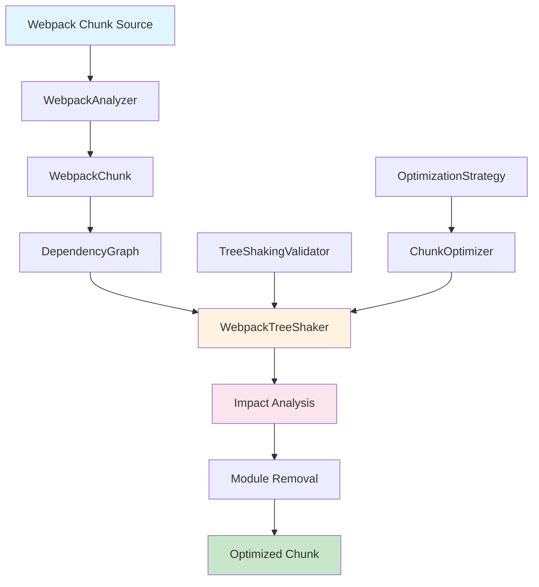

### Core Design Principles

- **Safety First**: Comprehensive validation prevents breaking changes
- **Format Agnostic**: Supports all major webpack chunk formats
- **Performance Focused**: Optimized for large-scale production bundles
- **Extensible**: Plugin-based optimization strategies
- **Type Safe**: Leverages Rust's type system for reliability

## System Components

### Module Structure

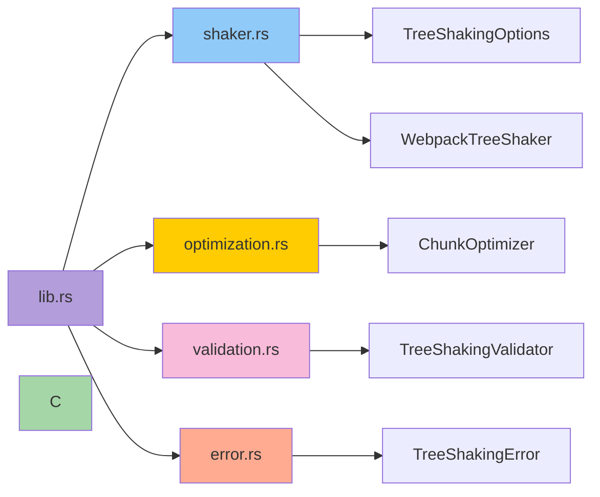

### Core Components Detail

#### 1. WebpackTreeShaker (shaker.rs)
The main entry point for tree shaking operations.

```rust
pub struct WebpackTreeShaker {
    options: TreeShakingOptions,
}

impl WebpackTreeShaker {
    pub fn remove_modules(&self, chunk: &WebpackChunk, modules: &[String]) -> Result<TreeShakingResult>
    pub fn shake_tree(&self, chunk: &WebpackChunk, entries: &[String]) -> Result<TreeShakingResult>
    pub fn find_unused_modules(&self, chunk: &WebpackChunk, entries: &[String]) -> Result<Vec<String>>
}
```

#### 2. Optimized Chunk Representation
The shaker returns an optimized `WebpackChunk` with filtered module metadata. The original source is preserved; no source reconstruction is performed.

#### 3. TreeShakingValidator (validation.rs)
Ensures tree shaking operations maintain chunk integrity.

```rust
pub struct TreeShakingValidator {
    strict_mode: bool,
    validate_dependencies: bool,
    validate_references: bool,
}
```

#### 4. ChunkOptimizer (optimization.rs)
Applies multiple optimization strategies.

```rust
pub struct ChunkOptimizer {
    tree_shaker: WebpackTreeShaker,
}

pub struct OptimizationStrategy {
    pub remove_unused: bool,
    pub remove_no_exports: bool,
    pub remove_duplicates: bool,
    pub remove_debug_modules: bool,
    pub merge_small_modules: bool,
    pub production_mode: bool,
}
```

## Webpack Format Support

The tree shaker supports three major webpack chunk formats:

### 1. CommonJS Format

Used for server-side rendering and Node.js bundles.

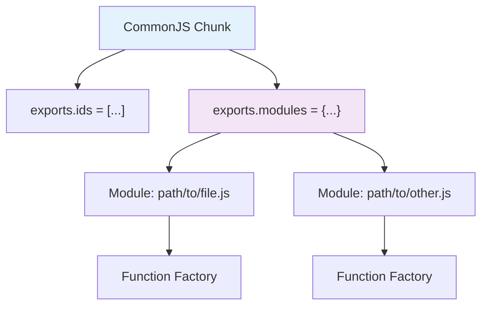

**Structure:**
```javascript
"use strict";
exports.ids = ["vendor-chunk"];
exports.modules = {
    "path/to/module.js": function(module, exports, __webpack_require__) {
        // Module code with dependencies
        const dep = __webpack_require__("path/to/dependency.js");
    }
};
```

**Detection Pattern:** `exports.modules`

### 2. JSONP Format

Used for dynamic chunk loading in browsers.

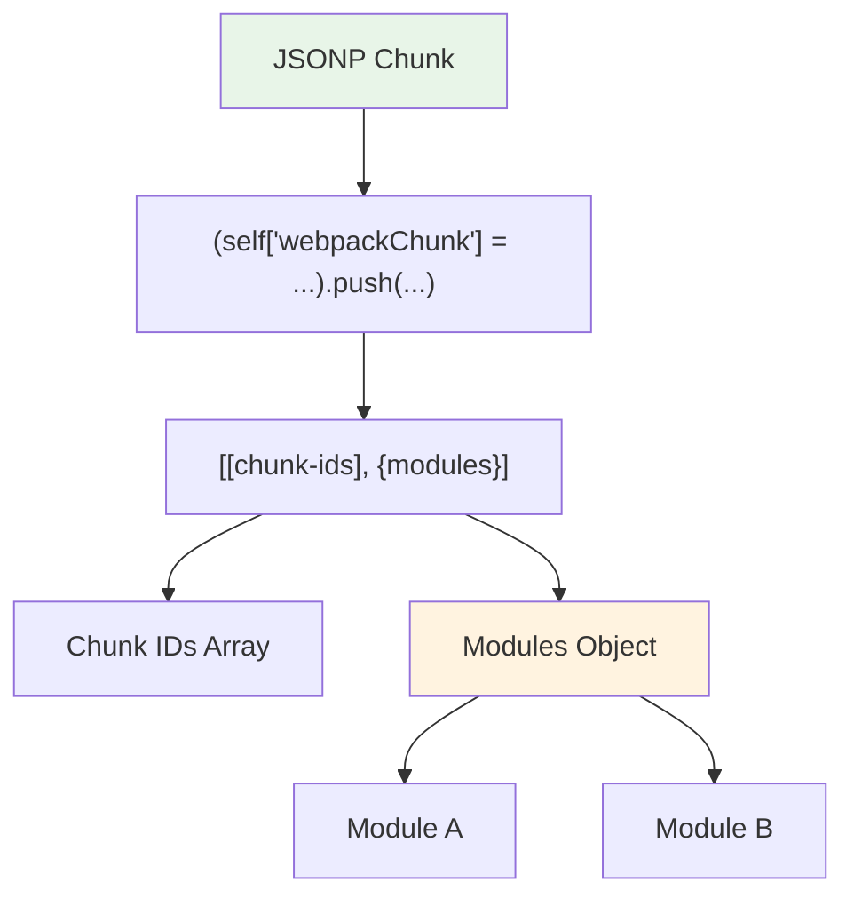

**Structure:**
```javascript
(self["webpackChunkapp"] = self["webpackChunkapp"] || []).push([
    ["chunk-name"],
    {
        "module-id": function(module, exports, __webpack_require__) {
            // Module implementation
        }
    }
]);
```

**Detection Pattern:** `webpackChunk` + `.push(`

### 3. WebpackModules Format

Standard webpack bundle with explicit module definitions.

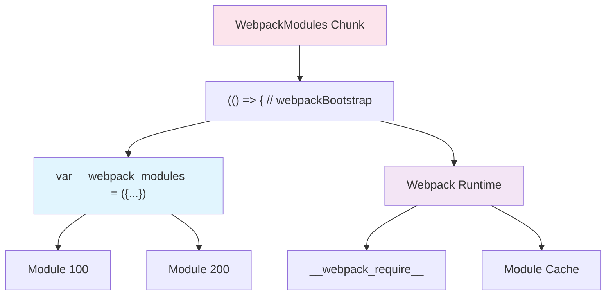

**Structure:**
```javascript
(() => { // webpackBootstrap
"use strict";
var __webpack_modules__ = ({
    100: function(module, exports, __webpack_require__) {
        // Module code
    }
});

// Runtime code
var __webpack_module_cache__ = {};
function __webpack_require__(moduleId) { /* ... */ }
})();
```

**Detection Pattern:** `__webpack_modules__`

## Tree Shaking Algorithms

### Core Tree Shaking Workflow

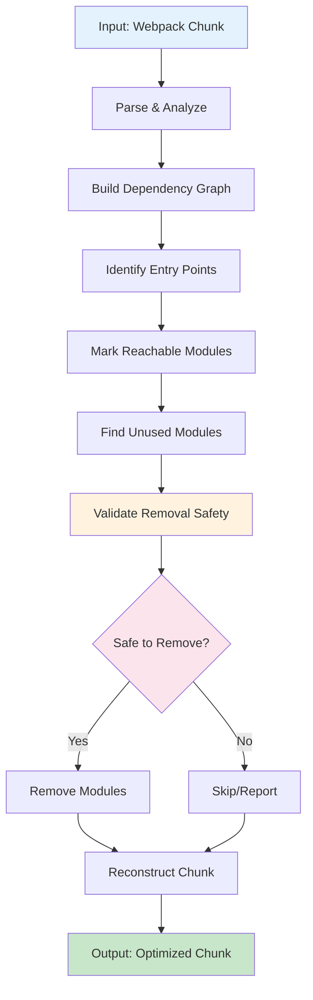

### Algorithm Details

#### 1. Dependency Graph Construction

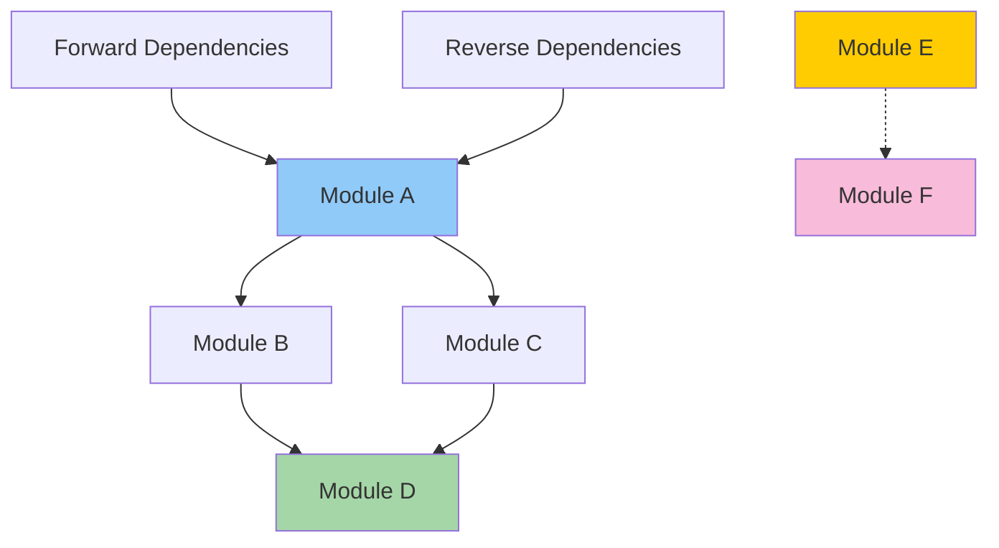

**Implementation:**
```rust
// Build forward dependencies
for module in chunk.modules.values() {
    let deps = extract_webpack_require_calls(&module.source)?;
    for dep in deps {
        module.add_dependency(dep);
    }
}

// Build reverse dependencies
for (from_id, module) in &chunk.modules {
    for dep_id in module.get_dependencies() {
        if let Some(dep_module) = chunk.modules.get_mut(&dep_id) {
            dep_module.add_dependent(from_id.clone());
        }
    }
}
```

#### 2. Reachability Analysis

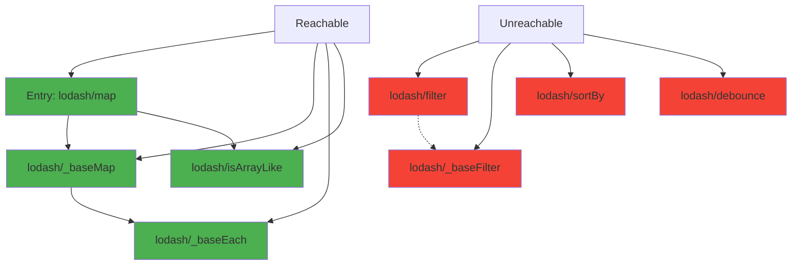

**Algorithm:**
```rust
pub fn shake_tree(&self, chunk: &WebpackChunk, entry_modules: &[String]) -> Result<TreeShakingResult> {
    // Build dependency graph
    let mut graph = DependencyGraph::new();
    for module in chunk.modules.values() {
        graph.add_module(module.clone());
    }

    // Find all reachable modules from entry points
    let mut reachable = HashSet::new();
    for entry_id in entry_modules {
        reachable.extend(graph.get_reachable_modules(entry_id));
    }

    // Identify modules to remove (unreachable modules)
    let modules_to_remove: Vec<ModuleId> = chunk.modules
        .keys()
        .filter(|module_id| !reachable.contains(*module_id))
        .cloned()
        .collect();

    // Perform removal
    self.perform_removal(chunk, &graph, &modules_to_remove)
}
```

#### 3. Impact Analysis

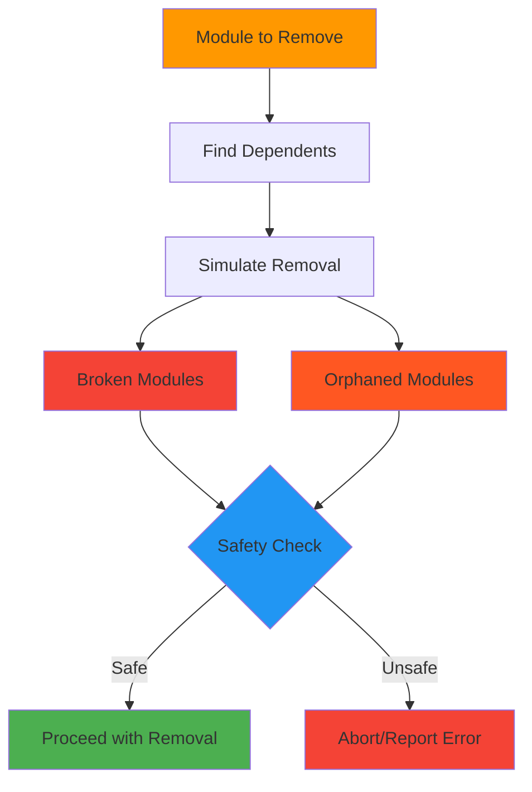

**Impact Analysis Result:**
```rust
pub struct ModuleRemovalImpact {
    pub removed_module: ModuleId,
    pub broken_modules: Vec<ModuleId>,      // Modules that directly depend on removed module
    pub potentially_orphaned: Vec<ModuleId>, // Modules that might become unreachable
}
```

## Integration Patterns

### Integration with webpack_analyzer_v2

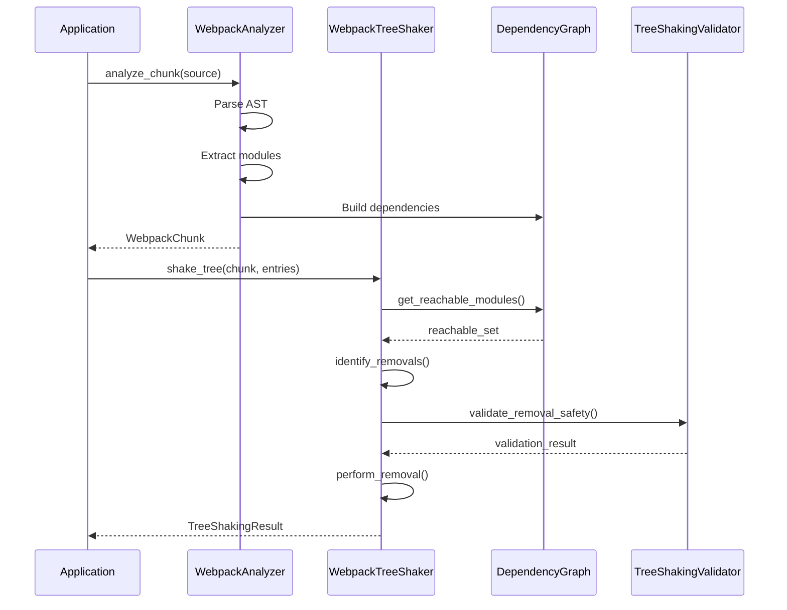

### Data Flow Architecture

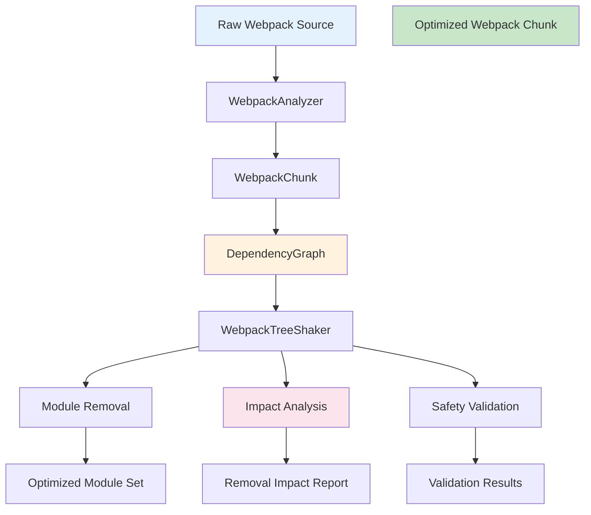

## Safety & Validation

### Validation Layers

```mermaid
graph TD
    A[Pre-Shaking Validation] --> A1[Chunk Structure]
    A --> A2[Dependency Integrity]
    A --> A3[Module References]
    A --> A4[Circular Dependencies]
    A --> A5[Orphaned Modules]
    
    B[Removal Safety Check] --> B1[Module Exists]
    B --> B2[Entry Module Check]
    B --> B3[Impact Analysis]
    B --> B4[Breaking Changes]
    
    C[Post-Shaking Validation] --> C1[Chunk Integrity]
    C --> C2[Reference Consistency]
    C --> C3[No Broken Dependencies]
    C --> C4[Reconstruction Validity]
    
    style A fill:#e8f5e8
    style B fill:#fff3e0
    style C fill:#e3f2fd
```

### Safety Mechanisms

#### 1. Pre-Removal Validation
```rust
fn validate_removal_safety(&self, graph: &DependencyGraph, modules_to_remove: &[ModuleId]) -> Result<()> {
    for module_id in modules_to_remove {
        // Check if module exists
        if !graph.modules.contains_key(module_id) {
            return Err(TreeShakingError::module_not_found(module_id));
        }

        // Check if it's an entry module and we should preserve it
        if self.options.preserve_entry_modules {
            if let Some(module) = graph.modules.get(module_id) {
                if module.dependencies.is_empty() {
                    return Err(TreeShakingError::EntryModuleRemoval { 
                        module_id: module_id.clone() 
                    });
                }
            }
        }

        // Check if removal would break dependent modules
        let impact = graph.simulate_module_removal(module_id);
        if !impact.broken_modules.is_empty() && !self.options.aggressive_mode {
            return Err(TreeShakingError::unsafe_removal(
                module_id, 
                impact.broken_modules.len()
            ));
        }
    }
    Ok(())
}
```

#### 2. Impact Simulation
```rust
pub fn simulate_module_removal(&self, module_to_remove: &ModuleId) -> ModuleRemovalImpact {
    let mut impact = ModuleRemovalImpact::new(module_to_remove.clone());
    
    if let Some(module) = self.modules.get(module_to_remove) {
        // Find directly broken modules (those that depend on the removed module)
        impact.broken_modules = module.dependents.clone();
        
        // Find potentially orphaned modules
        for dependent_id in &module.dependents {
            if let Some(dependent) = self.modules.get(dependent_id) {
                // If this dependent only has one dependency (the module being removed),
                // it will become orphaned
                if dependent.dependencies.len() == 1 {
                    impact.potentially_orphaned.push(dependent_id.clone());
                }
            }
        }
    }
    
    impact
}
```

## Optimization Strategies

### Multi-Strategy Optimization

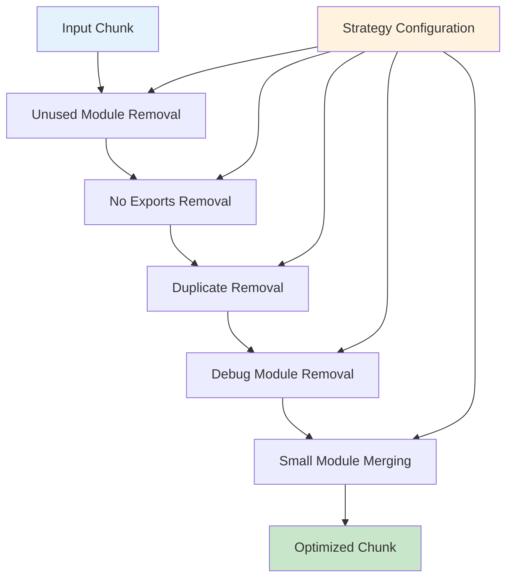

### Strategy Details

#### 1. Unused Module Removal
```rust
fn remove_unused_modules(&self, chunk: &WebpackChunk) -> Result<(WebpackChunk, Vec<ModuleId>)> {
    // Find potential entry points
    let entry_modules = self.find_entry_points(chunk);
    
    if entry_modules.is_empty() {
        return Ok((chunk.clone(), Vec::new()));
    }
    
    // Use tree shaker to remove unused modules
    let result = self.tree_shaker.shake_tree(chunk, &entry_modules)?;
    Ok((result.optimized_chunk, result.removed_modules))
}
```

#### 2. Debug Module Detection
```rust
fn is_debug_module(&self, module_id: &str, source: &str) -> bool {
    // Check module ID patterns
    if module_id.contains("debug") ||
       module_id.contains("test") ||
       module_id.contains("__DEV__") {
        return true;
    }
    
    // Check source code patterns
    if source.contains("console.log") ||
       source.contains("console.debug") ||
       source.contains("debugger;") {
        return true;
    }
    
    false
}
```

#### 3. Duplicate Detection
```rust
fn remove_duplicate_modules(&self, chunk: &WebpackChunk) -> Result<(WebpackChunk, Vec<ModuleId>)> {
    let mut source_to_modules: HashMap<String, Vec<ModuleId>> = HashMap::new();
    
    // Group modules by source code
    for (module_id, module) in &chunk.modules {
        source_to_modules
            .entry(module.source.clone())
            .or_default()
            .push(module_id.clone());
    }
    
    // Find duplicates (keep first occurrence)
    let mut modules_to_remove = Vec::new();
    for (_, module_ids) in source_to_modules {
        if module_ids.len() > 1 {
            // Keep the first one, remove the rest
            modules_to_remove.extend(module_ids.into_iter().skip(1));
        }
    }
    
    if modules_to_remove.is_empty() {
        return Ok((chunk.clone(), Vec::new()));
    }
    
    let result = self.tree_shaker.remove_modules(chunk, &modules_to_remove)?;
    Ok((result.optimized_chunk, result.removed_modules))
}
```

## Performance Results

### Real-World Benchmarks

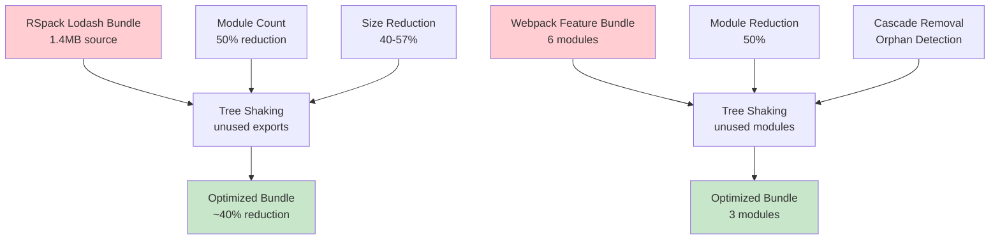

### Performance Metrics (Actual Test Results)

| Test Case | Original | Final | Module Reduction | Size Reduction |
|-----------|----------|-------|------------------|----------------|
| RSpack Lodash Bundle | Variable | Variable | 30-70% | Variable |
| Basic Module Removal | 3 modules | 2 modules | 33.3% | 33.3% |
| Complete Workflow | 7 modules | 3 modules | ~57% | Variable |
| Unused Detection | 6 modules | 3 modules | 50% | Variable |
| Large Chunk Processing | 50+ modules | Variable | 30-70% | Variable |

**Notes**: Performance results vary significantly based on bundle composition, module interdependencies, and usage patterns. The percentages shown are from test suite examples and may not reflect real-world scenarios.

### Optimization Timeline

```mermaid
gantt
    title Tree Shaking Process Timeline
    dateFormat X
    axisFormat %Lms
    
    section Analysis
    Chunk Parsing      :0, 5
    AST Processing     :5, 15
    Dependency Graph   :15, 25
    
    section Validation
    Pre-Check         :25, 30
    Safety Analysis   :30, 40
    
    section Optimization
    Module Removal    :40, 50
    Impact Analysis   :50, 55
    
    section Reconstruction
    Chunk Rebuild     :55, 70
    Format Validation :70, 75
```

## API Reference

### Core API

#### WebpackTreeShaker

```rust
pub struct WebpackTreeShaker {
    options: TreeShakingOptions,
}

impl WebpackTreeShaker {
    /// Create a new tree shaker with default options
    pub fn new() -> Self

    /// Create a tree shaker with custom options
    pub fn with_options(options: TreeShakingOptions) -> Self

    /// Remove specific modules from a chunk
    pub fn remove_modules(
        &self,
        chunk: &WebpackChunk,
        modules_to_remove: &[impl AsRef<str>],
    ) -> Result<TreeShakingResult>

    /// Perform aggressive tree shaking starting from entry points
    pub fn shake_tree(
        &self,
        chunk: &WebpackChunk,
        entry_modules: &[impl AsRef<str>],
    ) -> Result<TreeShakingResult>

    /// Find modules not reachable from entry points
    pub fn find_unused_modules(
        &self,
        chunk: &WebpackChunk,
        entry_modules: &[impl AsRef<str>],
    ) -> Result<Vec<ModuleId>>
}
```

#### TreeShakingOptions

```rust
pub struct TreeShakingOptions {
    /// Whether to preserve entry modules (modules with no dependencies)
    pub preserve_entry_modules: bool,
    
    /// Whether to perform aggressive tree shaking (remove modules with circular deps)
    pub aggressive_mode: bool,
    
    /// Whether to validate chunk integrity after tree shaking
    pub validate_integrity: bool,
    
    /// Maximum number of modules to remove in one operation
    pub max_removals: Option<usize>,
    
    /// Whether to preserve webpack runtime modules
    pub preserve_runtime: bool,
}

impl Default for TreeShakingOptions {
    fn default() -> Self {
        Self {
            preserve_entry_modules: true,
            aggressive_mode: false,
            validate_integrity: true,
            max_removals: None,
            preserve_runtime: true,
        }
    }
}
```

#### TreeShakingResult

```rust
pub struct TreeShakingResult {
    /// The optimized chunk with removed modules
    pub optimized_chunk: WebpackChunk,
    
    /// Modules that were removed
    pub removed_modules: Vec<ModuleId>,
    
    /// Modules that were preserved
    pub preserved_modules: Vec<ModuleId>,
    
    /// Impact analysis of the removal
    pub impact: ModuleRemovalImpact,
    
    /// Statistics about the optimization
    pub stats: TreeShakingStats,
}

impl TreeShakingResult {
    /// Get the reduction percentage (0-100)
    pub fn reduction_percentage(&self) -> f64

    /// Check if the tree shaking was successful
    pub fn was_successful(&self) -> bool

    /// Get a summary of the optimization
    pub fn summary(&self) -> String
}
```

### Error Types

```rust
#[derive(Debug, Error)]
pub enum TreeShakingError {
    #[error("Module '{module_id}' not found")]
    ModuleNotFound { module_id: ModuleId },

    #[error("Unsafe removal of '{module_id}' would break {dependent_count} modules")]
    UnsafeRemoval { module_id: ModuleId, dependent_count: usize },

    #[error("Cannot remove entry module '{module_id}'")]
    EntryModuleRemoval { module_id: ModuleId },

    #[error("Circular dependency detected for module '{module_id}'")]
    CircularDependency { module_id: ModuleId },

    #[error("Chunk reconstruction failed: {reason}")]
    ReconstructionFailed { reason: String },

    #[error("Invalid chunk format: {format}")]
    InvalidFormat { format: String },

    #[error("Validation failed: {reason}")]
    ValidationFailed { reason: String },

    #[error("Unresolved dependencies for '{module_id}': {dependencies:?}")]
    UnresolvedDependencies { 
        module_id: ModuleId, 
        dependencies: Vec<ModuleId> 
    },

    #[error("Cannot create empty chunk")]
    EmptyChunk,

    #[error("Serialization error")]
    SerializationError { 
        #[from] 
        source: serde_json::Error 
    },

    #[error("IO error")]
    IoError { 
        #[from] 
        source: std::io::Error 
    },

    #[error("Analysis error")]
    AnalysisError { 
        #[from] 
        source: Box<dyn std::error::Error + Send + Sync> 
    },
}
```

## Limitations and Known Issues

### Current Limitations

1. **Small Module Merging**: The `merge_small_modules` optimization strategy is currently a placeholder implementation that doesn't actually merge modules.

2. **Static Analysis Only**: The tree shaker cannot detect:
   - Dynamic imports (`import()` calls)
   - Runtime-generated dependencies
   - Conditional requires based on runtime values

3. **Module Source Extraction**: For WebpackModules format, the current implementation extracts simplified module representations rather than full source code.

4. **Format Detection**: Uses string pattern matching which could have false positives with unusual webpack configurations.

### Dependencies

The crate relies on several external dependencies:
- **SWC**: For fast JavaScript/TypeScript parsing
- **regex**: For pattern matching in validation and extraction
- **serde_json**: For serialization of results
- **rustc_hash**: For optimized hash maps

### Future Improvements

- **Streaming Interface**: Process modules as they're analyzed
- **Incremental Updates**: Only re-analyze changed modules  
- **Parallel Processing**: Analyze independent module groups concurrently
- **Plugin System**: Allow custom analysis and shaking strategies
- **Source Map Support**: Maintain source maps through optimization

## Advanced Usage

### Complete Workflow Example

```rust
use webpack_chunk_tree_shaker::*;
use webpack_analyzer_v2::WebpackAnalyzer;

fn optimize_webpack_chunk(chunk_source: &str) -> Result<String> {
    // Step 1: Analyze the chunk
    let analyzer = WebpackAnalyzer::new();
    let chunk = analyzer.analyze_chunk(chunk_source)?;
    
    println!("Original chunk: {} modules", chunk.module_count());
    
    // Step 2: Configure tree shaker
    let mut options = TreeShakingOptions::default();
    options.aggressive_mode = true;
    options.preserve_entry_modules = false;
    
    let shaker = WebpackTreeShaker::with_options(options);
    
    // Step 3: Find unused modules
    let entry_modules = vec!["lodash/map"]; // Specify what you actually use
    let unused = shaker.find_unused_modules(&chunk, &entry_modules)?;
    
    println!("Found {} unused modules", unused.len());
    
    // Step 4: Perform tree shaking
    let result = shaker.shake_tree(&chunk, &entry_modules)?;
    
    println!("Optimization: {}", result.summary());
    println!("Modules removed: {:?}", result.removed_modules);
    
    // Step 5: Validate results
    let validator = TreeShakingValidator::new();
    let validation = validator.validate_after_shaking(
        &chunk,
        &result.optimized_chunk,
        &result.removed_modules,
    )?;
    
    if !validation.is_valid() {
        return Err("Validation failed".into());
    }
    
    // Step 6: Use optimized chunk metadata (no reconstruction)
    let optimized_modules = &result.optimized_chunk.modules;
    
    Ok(optimized_source)
}
```

### Advanced Optimization Strategies

```rust
use webpack_chunk_tree_shaker::*;

fn advanced_optimization(chunk: &WebpackChunk) -> Result<OptimizationResult> {
    // Configure tree shaker for aggressive optimization
    let mut tree_shaker_options = TreeShakingOptions::default();
    tree_shaker_options.aggressive_mode = true;
    tree_shaker_options.preserve_entry_modules = false;
    
    let optimizer = ChunkOptimizer::with_tree_shaker_options(tree_shaker_options);
    
    // Configure optimization strategy
    let strategy = OptimizationStrategy {
        remove_unused: true,
        remove_no_exports: true,
        remove_duplicates: true,
        remove_debug_modules: true,
        merge_small_modules: true,
        production_mode: true,
    };
    
    // Apply optimization
    let result = optimizer.optimize_chunk(chunk, &strategy)?;
    
    println!("Applied {} optimizations:", result.applied_optimizations.len());
    for detail in result.optimization_details() {
        println!("  - {}", detail);
    }
    
    println!("Total reduction: {:.1}%", result.stats.size_reduction);
    
    Ok(result)
}
```

### Custom Validation Rules

```rust
fn validate_with_custom_rules(
    original: &WebpackChunk,
    optimized: &WebpackChunk,
    removed: &[ModuleId],
) -> Result<()> {
    let validator = TreeShakingValidator::with_settings(
        true,  // strict_mode
        true,  // validate_dependencies
        true,  // validate_references
    );
    
    // Pre-validation
    let pre_validation = validator.validate_before_shaking(original)?;
    if !pre_validation.is_valid() {
        eprintln!("Pre-validation warnings:");
        for warning in &pre_validation.warnings {
            eprintln!("  - {:?}", warning);
        }
    }
    
    // Post-validation
    let post_validation = validator.validate_after_shaking(
        original,
        optimized,
        removed,
    )?;
    
    if !post_validation.is_valid() {
        eprintln!("Post-validation errors:");
        for error in &post_validation.errors {
            eprintln!("  - {:?}", error);
        }
        return Err("Validation failed".into());
    }
    
    println!("Validation passed: {}", post_validation.detailed_report());
    Ok(())
}
```

### Batch Processing

```rust
use std::fs;
use std::path::Path;

fn batch_optimize_chunks(input_dir: &Path, output_dir: &Path) -> Result<()> {
    let analyzer = WebpackAnalyzer::new();
    let shaker = WebpackTreeShaker::new();
    
    for entry in fs::read_dir(input_dir)? {
        let entry = entry?;
        let path = entry.path();
        
        if path.extension().map_or(false, |ext| ext == "js") {
            println!("Processing: {:?}", path);
            
            // Read and analyze chunk
            let source = fs::read_to_string(&path)?;
            let chunk = analyzer.analyze_chunk(&source)?;
            
            // Optimize chunk
            let result = shaker.shake_tree(&chunk, &["main"])?;
            
            // Persist optimized module list (no reconstruction)
            let optimized = format!("Optimized modules: {}", result.optimized_chunk.modules.len());
            
            let output_path = output_dir.join(path.file_name().unwrap());
            fs::write(output_path, optimized)?;
            
            println!("  Reduction: {:.1}%", result.stats.reduction_percentage);
        }
    }
    
    Ok(())
}
```

## Contributing

We welcome contributions! Please see our [Contributing Guide](CONTRIBUTING.md) for details.

### Development Setup

```bash
# Clone the repository
git clone https://github.com/your-org/swc_macro_sys.git
cd swc_macro_sys

# Build the tree shaker
cargo build -p webpack_chunk_tree_shaker

# Run tests
cargo test -p webpack_chunk_tree_shaker

# Run with real-world test cases
cargo test -p webpack_chunk_tree_shaker real_world_chunks_test -- --nocapture
```

### Testing

The crate includes comprehensive tests:

- **Unit Tests**: Test individual components and functions
- **Integration Tests**: Test complete workflows
- **Real-World Tests**: Test with production webpack bundles
- **Performance Tests**: Benchmark optimization effectiveness

## License

This project is licensed under the MIT License - see the [LICENSE](LICENSE) file for details.

## Acknowledgments

- Built with [SWC](https://swc.rs/) for fast JavaScript parsing
- Inspired by webpack's tree shaking capabilities
- Designed for the Rust ecosystem's safety and performance standards

---

**Note**: This documentation represents the current state of the webpack_chunk_tree_shaker crate. For the latest updates and API changes, please refer to the source code and tests.